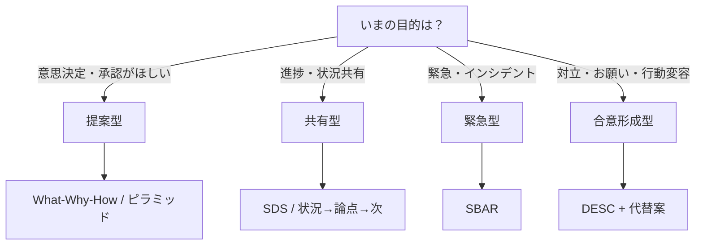

# 社内会議・上司報告・関係者説明で「わかりやすい」と評価される説明技術レポート

- 作成日: 2026-04-11 16:30 JST
- 作成者: Codex (GPT-5)
- 更新日: 2026-04-11

## エグゼクティブサマリ

社内で「話が長い／結論が遅い／論点が散る／抽象的すぎる／説明不足」が起きる主因は、①そもそも“いま答えるべき問い（論点）”が言語化されていない、②聞き手の意思決定に必要な情報の順序や粒度が設計されていない、③聞き手の作業記憶（ワーキングメモリ）容量を超える提示をしている——の3点に集約できる。論点が曖昧だと議論や説明が迷走しやすいことは、ビジネス教育でも繰り返し指摘されている。citeturn11view7 また、ワーキングメモリが「処理できる量・時間に制約がある」ことを前提に情報提示を設計すべき、というのが認知負荷理論の立場である。citeturn11view0turn15view3turn11view1

改善の核は、「結論先行（Answer first）＋構造化（ピラミッド／MECE）＋抽象⇄具体の往復＋聞き手別の編集」の4点を“型”として運用すること。結論先行の型としては、短時間で主張を通す **PREP**（結論→理由→具体例→結論）や、要点共有に強い **SDS**（要点→詳細→要点）、緊急連絡の型として **SBAR**（状況→背景→評価→提案）が実務に流用しやすい。citeturn12view6turn12view7turn10view3turn12view9 さらに「状況→複雑化→問い→答え」で導入を整える **SCQA** は、長めの説明でも“今なにが論点か”を揃えるのに向く。citeturn13search1

運用上の要点は、説明を「情報の羅列」ではなく「聞き手が理解・判断するための最短ルート」に再編集すること。文レベルでも「一文を短く」「一文一論点」などの原則が可読性を押し上げる。citeturn10view0 加えて、余計な装飾・脱線・背景過多を削る“ノイズ除去”は、マルチメディア学習研究でも学習・理解を阻害し得る要因（余計な素材が作業記憶資源を奪う）として整理されている。citeturn11view4turn15view0

このレポートは、上記を「原則」「テンプレ」「失敗→修正」「練習メニュー」「アプリ化要件」「参照カテゴリ」に落とし込み、会議・上司報告・関係者説明にそのまま転用できる形で提示する。根拠は、日本語の一次・準一次資料（公用文ガイド・出版社情報・ビジネス教育）と、説明設計の基礎になる学術知見（認知負荷理論・作業記憶・テスト効果・分散学習）を組み合わせた。citeturn10view0turn10view1turn15view3turn11view1turn15view1turn10view4

## わかりやすい説明の原則一覧

「わかりやすい説明」は才能ではなく、**設計（設計図＝型）→編集（不要を削る）→検証（相手目線で穴を埋める）**の手順で再現できるスキルである。根拠として、①作業記憶に制約があるため情報を“構造化・分割”する必要があること（認知負荷理論／作業記憶モデル）、②短文・一文一論点などの文章作法が理解負荷を下げること（公的ガイド）、③論点設定の有無が議論や説明の迷走を左右すること（ビジネス教育）が挙げられる。citeturn11view0turn11view1turn11view3turn10view0turn11view7

| 原則 | ねらい（なぜ効くか） | 実務チェック（最小セット） | 定型表現（そのまま使える） |
|---|---|---|---|
| 論点を「問い」の形で固定する | 論点が曖昧だと、説明も議論も迷走しやすいciteturn11view7 | 「今日この場で答える問いは何か」を1文にする | 「今日決めたいのは、**◯◯をA案/B案どちらで進めるか**の1点です」 |
| 結論先行で先に“答え”を渡す | 聞き手の判断・把握を先に完了させ、以降を“検証”に変える（PREP／SBAR／ピラミッド）citeturn12view6turn10view3turn13search1 | 冒頭15秒で「結論・依頼・期限」を言える | 「結論から申し上げます。**◯◯です**。確認したいのは**◯◯**です」 |
| 要点→詳細→要点で“枠”を維持する | 先に枠を提示すると理解が安定する（SDS）citeturn12view7 | 要点を先に宣言し、最後に同じ要点で閉じる | 「要点は2つです。…（詳細）…以上、要点は2つです」 |
| 理由・根拠を同じ種類で束ねる（MECE/グルーピング） | 混在（事実/意見/感情）が入ると、聞き手が頭の中で仕分けを始め理解が落ちる；MECEは分解・構造化の完成度確認に有効citeturn10view6turn12view5 | 「同じレイヤーは同じ種類」「重複・漏れがない」 | 「理由は3点で、①◯◯（因果）②◯◯③◯◯です」 |
| 情報を“チャンク”で出す（詰め込み禁止） | 作業記憶は容量制約があり、焦点化できるチャンク数にも限界があるciteturn11view1turn11view3turn11view0 | 一度に出す列挙は「3点」基準（多くても5点） | 「まず大枠3点、そのあと必要なら深掘ります」 |
| 余計な背景・装飾を削る（ノイズ除去） | 余計な素材が作業記憶資源を奪い、理解や転移を下げ得る（coherence）citeturn11view4turn15view0 | 「意思決定に要らない背景は後ろへ」 | 「背景は後ほど補足します。先に判断材料を述べます」 |
| 文を短くし、一文一論点にする | 長文は係り受け・主語述語が乱れやすく読みにくい／一文一論点が読み取りを助けるciteturn10view0 | 50～60字付近で読みにくさを疑い分割citeturn10view0 | 「結論。理由。根拠。次の一手。」（短文で刻む） |
| 抽象⇄具体を往復する | 抽象だけだと行動に落ちず、具体だけだと意味が伝わらない。思考の根本は往復だと整理されているciteturn12view3 | 抽象（主張）→具体（事実/例/数字）→抽象（含意/次の一手） | 「つまり◯◯です。根拠は◯◯（数字/事実）。だから次は◯◯します」 |
| 聞き手ごとに“必要な粒度”へ編集する | 読み手の知識前提を想定し、理解できる言葉へ工夫することが求められるciteturn10view1 | 上司＝判断材料、同僚＝連携仕様、関係者＝合意条件に寄せる | 「（上司向け）判断いただきたいのは◯◯です」／「（同僚向け）役割分担は◯◯です」 |
| 最後に“依頼/判断/次アクション”を明示する | 報連相は業務効率化・トラブル回避・状況共有に資するため、次の行動が明確だと機能するciteturn11view8 | 「誰が・いつまでに・何を」を宣言 | 「本日中に、◯◯について**承認**をお願いします」 |

## 実務で使える説明テンプレート

テンプレは「場面×目的」で使い分けると、説明の長さ・順序・粒度が自動で揃う。ここでは、会議・上司報告・関係者説明に直結する型を、**穴埋め**と**定型表現**で提示する（PREP/SDS/SBAR/SCQAは、説明順序を固定して“結論遅れ・散漫”を防ぐ狙いが共通）。citeturn12view6turn12view7turn10view3turn13search1

### 型の選び方フロー

（目的別に、最短で“適切な順序”へ寄せるための簡易フロー）

上の分類の根拠は、提案・共有・緊急・合意形成で「相手が最初に知りたい情報」が異なるためで、緊急連絡では“状況を最初に”置くことが有効だとSBARの実務ガイドが明示している。citeturn12view9turn10view3

### 会議テンプレ

**会議冒頭「論点固定」テンプレ（30秒）**  
- 「今日決めたいのは、【論点（問い）】です」  
- 「選択肢は【A】と【B】（必要なら【C】）です」  
- 「判断軸は【コスト/期限/品質/リスク】で、結論は【推奨案】です」  
- 「根拠は3点で、①【データ/事実】②【制約】③【リスク】です」  
- 「この会議のアウトプットは【承認/方針決定/担当決め】です」

論点を冒頭で固定しないと会議が迷走しやすい、という指摘はビジネス教育で明確にされている。citeturn11view7

**進行中の“脱線戻し”定型表現**  
- 「いまの論点は【◯◯】なので、【△△】は後半のQ&Aで扱います」  
- 「いったん整理します。**決めたい問い**は【◯◯】、**未決**は【△△】です」  
- 「ここまでの議論を要点にします。要点は【2点】です」

### 上司報告テンプレ

**上司への口頭報告（SDS：60秒）**（要点共有向け）citeturn12view7  
- Summary（要点）：「【案件名】、要点は【2点】です。①【結論/現状】②【相談/依頼】」  
- Details（詳細）：「①の背景は【事実/数字】、リスクは【◯◯】です。②は【選択肢A/B】で、推奨は【B】です」  
- Summary（要点）：「以上、①【結論/現状】②【依頼】の2点です」

**上司への提案報告（What-Why-How：90秒）**  
「何をすべきか」「なぜか」「どうするか」を揃える拡張型として整理されている。citeturn11view6  
- What：「結論は【◯◯を実施】です」  
- Why：「理由は【インパクト/リスク回避/期限】で、根拠は【データ】です」  
- How：「具体策は【3ステップ】。担当は【誰】、期限は【いつ】です」

**遅延・失敗・トラブル報告（PREP：60〜90秒）**（説明責任＋次アクション向け）citeturn12view6turn7search1  
- P：「結論として、【現状/未完了/遅延】です」  
- R：「理由は【要因】です」  
- E：「具体的には【事実（いつ何が）】で、影響は【範囲】です」  
- P：「対応として【暫定対応】、次に【恒久対応】を【期限】までに行います。判断が必要なのは【◯◯】です」

### 関係者説明テンプレ

**関係者向け「SCQA導入＋結論」**（利害調整・背景共有が必要な長め説明）citeturn13search1  
- S（状況）：「現在【前提/現状】です」  
- C（複雑化）：「しかし【問題/変化】が起きています」  
- Q（問い）：「では、【何をどうするべきか】？」  
- A（答え）：「提案は【◯◯】で、理由は【3点】です」

**合意形成（DESC：お願い・行動変容）**  
DESCはアサーションを4ステップに分解した枠組みとして整理されている。citeturn12view8  
- Describe（事実）：「【事実】が発生しています」  
- Express（影響/所感）：「その結果【影響】が出ています」  
- Suggest（提案）：「次から【具体的にこうしてほしい】です」  
- Choose（選択/結果）：「そうすると【望ましい結果】になります。難しければ代替案として【B】でも可です」

### 緊急・短時間の報告テンプレ

**SBAR（緊急連絡・短時間で状況を通す）**  
SBARカードは「状況→背景→評価→提案」の順で記載し、状況を最初に伝える設計になっている。citeturn10view3turn12view9  
ビジネス向けに言い換えると：

- S（状況）：「いま【何が起きているか】です。結論として【重大度/影響】は【◯◯】です」  
- B（背景）：「前提は【経緯/制約】です」  
- A（評価）：「原因は【仮説】、リスクは【◯◯】です」  
- R（提案/依頼）：「提案は【◯◯】。判断/支援が必要なのは【◯◯】です」

## よくある失敗と修正法

失敗の多くは「順序」「粒度」「根拠の置き場」が崩れているだけで、型を当て直せば短時間で改善できる。特に、“背景から話してしまう”癖は、聞き手が「何の話か」を掴めない時間を増やしやすい点でSBARの注意点とも一致する。citeturn12view9turn10view3

### 失敗例と改善例の比較表

| 典型的な失敗 | 失敗例（そのまま言うと） | 修正のコツ | 改善例（修正後） |
|---|---|---|---|
| 結論が遅い | 「あの…いろいろありまして、まず経緯なんですが…」 | 冒頭15秒で結論（要点）を宣言（PREP/SDS/SBAR）citeturn12view6turn12view7turn12view9 | 「結論から。**納期が2日遅れます**。理由は2点で…」 |
| 話が長い（削れない） | 「関連情報を全部説明します…」 | “意思決定に不要な背景”を後ろへ（coherence）citeturn11view4turn15view0 | 「判断に必要なのはAとBです。詳細資料は別紙で共有します」 |
| 論点が散る | 「AもBもCも気になります」 | 論点を問いで固定し、会議アウトプットを明示citeturn11view7 | 「今日の問いは**Aを採用するか**です。B/Cは派生なので後半で扱います」 |
| 抽象的で行動に落ちない | 「品質を上げましょう」 | 抽象→具体（数字/条件/例）→抽象（含意/次）を往復citeturn12view3turn12view6 | 「品質＝**初期不良率を1.2%→0.6%**に。まず検査工程を…」 |
| 説明不足と言われる | 「とにかく必要です」 | “Why（理由）”を3点に束ねて提示（ピラミッド/MECE）citeturn10view6turn12view5turn11view6 | 「必要な理由は3点。①影響②期限③リスク。根拠は…」 |
| 情報が多すぎて理解されない | 「要因は9個あります」 | チャンク化（3点）→必要なら詳細へ。作業記憶の制約を前提にするciteturn11view1turn11view3turn11view0 | 「大枠は3カテゴリ（人/プロセス/ツール）。今日はプロセスだけ深掘ります」 |
| 文が長くて読まれない | 「〜であり、〜であるため、〜しており…」 | 一文を短く／一文一論点（公用文）citeturn10view0 | 「結論。理由。根拠。対応。」（短文で分割） |
| 事実と意見が混ざる | 「多分Aが悪いと思います」 | Describe（事実）→Assessment（評価）→Request（提案）に分離（SBAR/DESC）citeturn10view3turn12view8 | 「事実：Aが発生。評価：原因はX仮説。提案：まずYを実施」 |

### モデル事例

**事例：上司への遅延報告（結論遅れ→PREPで矯正）**  
PREPは、最初と最後に要点を置き、理由と具体例で補強する構造として実務例付きで解説されている。citeturn7search1turn12view6  
- 失敗（NG）：経緯を延々説明し、最後に「つまり遅れます」  
- 改善（OK）：  
  「結論から。**資料印刷は未着手です**。理由は、緊急対応が入ったためです。具体的には【顧客対応】で、影響は【印刷開始が今日夕方】です。**本日20時までに印刷完了**します。リスクは【確認時間の圧縮】なので、【別担当のレビュー支援】をお願いします。」  
（＝結論→理由→具体→結論＋依頼）

**事例：関係者説明（“今なにが問題か”が揃わない→SCQA）**  
SCQAは、状況→複雑化→問い→答えで導入を設計する枠組みとして紹介されている。citeturn13search1  
- 改善（骨子）：  
  S「現状は◯◯運用」→C「しかし△△が顕在化」→Q「では何を変える？」→A「結論は□□に変更。理由は3点…」

**事例：1枚に収まらない説明（情報過多→A3化）**  
A3報告書は「必要な情報だけを選び、簡潔に表現し、説得力あるストーリーとして描く反復訓練」になると説明されている。citeturn10view2  
- 改善（運用）：関係者説明の資料を「1枚（A3相当）」に要約し、会議ではその1枚を“地図”として進行。詳細は別紙に退避。

## 短時間でできる練習法

練習は「才能」ではなく「設計」になり得る。ポイントは、(1) **短い反復**を連日行う、(2) **思い出す（テストする）**練習を入れる、(3) **間隔を空ける（分散させる）**、(4) **フィードバック**を得る——の4つ。テスト（想起）は長期保持を改善し得ることが実験的に示されており、citeturn15view1 分散学習（間隔を空ける反復）も多数研究の統合で効果が整理されている。citeturn10view4 また、熟達研究では、上達には目的をもった練習（deliberate practice）が重要だと整理されている。citeturn12view1

### 4週間プラン（テーマ）

| 週テーマ | ねらい | 重点ドリル | 成果物（週末） |
|---|---|---|---|
| 結論先行と論点固定 | 「結論が遅い／散る」を先に潰す | 冒頭15秒結論、問いの1文化 | 1分報告スクリプト×3本 |
| 構造化（MECE/ピラミッド） | 「論点が散る／説明不足」を構造で矯正 | 3点束ね、根拠の階層化 | 3段ピラミッドメモ×2本 |
| 抽象⇄具体の往復 | 「抽象的すぎる／具体過多」を往復で調整 | 抽象→具体→含意→次アクション | 事例説明（1分）×3本 |
| 聞き手別の編集と短縮 | 上司・同僚・関係者で話を“作り替える” | 同一内容を30秒/2分/5分に変換 | A3相当1枚要約×1本citeturn10view2 |

### 日次メニュー（毎日10分）

毎日やることを「固定5分＋回転5分」にして、実務投入を前提にする。

**固定5分（毎日）**  
1. 今日の説明予定（または昨日の会話）を1文で結論化（15秒で言えるまで削る）  
2. その結論に対して「理由は3点」と言い、3点を箇条書きせず口頭で言えるか確認（チャンク化）citeturn11view3turn11view1  
3. 根拠を1つだけ“具体”（数字/事実/例）で添える（抽象⇄具体）citeturn12view3  

**回転5分（曜日別）**  
| 曜日 | 回転ドリル（5分） | 目的 |
|---|---|---|
| 月 | 「今日の問い」を作る（会議の論点を疑問文で1つ）citeturn11view7 | 論点固定 |
| 火 | PREPで30秒スクリプト化citeturn12view6turn7search1 | 結論先行 |
| 水 | SDSで共有メモを作るciteturn12view7 | 要点維持 |
| 木 | SBARで“緊急版”に縮めるciteturn10view3turn12view9 | 背景過多防止 |
| 金 | 「一文一論点」リライト（長文を2〜3文に分割）citeturn10view0 | 可読性 |
| 土 | 週の1テーマを“テスト”する（何も見ずに1分説明→録音→自己採点）citeturn15view1 | 想起練習 |
| 日 | 来週の重要説明を1枚に要約（A3相当）citeturn10view2 | 構造化 |

## アプリ化できる機能案

「説明が苦手」をアプリで支援するなら、重要なのは生成よりも **(1)論点固定、(2)順序制御、(3)粒度調整、(4)練習とフィードバック** を機能として埋め込むこと。根拠として、短文・一文一論点などのチェックは公式ガイドで明示され、citeturn10view0 情報過多の抑制は認知負荷/作業記憶の知見から必要であり、citeturn11view0turn11view1turn11view3 想起練習・分散反復は学習効果が示されている。citeturn15view1turn10view4

| 優先度 | 機能 | できること | 失敗タイプへの効き方 |
|---|---|---|---|
| 高 | 論点ジェネレータ | 入力：「状況」→出力：「今日の問い（論点）」テンプレ | 論点が散る／結論が遅いciteturn11view7 |
| 高 | 型セレクタ（PREP/SDS/SBAR/SCQA/DESC） | 目的・聞き手・緊急度を選ぶと最適テンプレを提示 | 順序崩れを自動矯正citeturn12view6turn12view7turn10view3turn13search1turn12view8 |
| 高 | 冒頭15秒チェッカー | 最初の2文に「結論/依頼/期限」があるか判定 | 結論が遅い／長い |
| 高 | チャンク・列挙チェック | 列挙数を検出し「3点化」提案（まとめ直し） | 情報過多／説明不足（整理不足）citeturn11view3turn11view1 |
| 高 | 一文一論点・長文分割支援 | 50〜60字超を警告、分割案を提示citeturn10view0 | 長い／読みにくい |
| 中 | 抽象⇄具体スライダー | 「抽象寄り/具体寄り」を可視化し、例・数字要求 | 抽象的すぎる／具体の羅列 |
| 中 | 根拠の型（事実/仮説/リスク/次アクション） | 事実と意見を分離して入力させる | 事実と意見が混ざるciteturn10view3turn12view8 |
| 中 | タイムボックス練習（30秒/2分/5分） | 台本＋タイマー＋録音＋自己採点（想起） | 長い／まとまらないciteturn15view1 |
| 低 | A3一枚要約モード | 1ページの骨子（結論→根拠→施策→次）に強制 | 情報過多／散漫citeturn10view2 |
| 低 | 個人ダッシュボード | 結論位置、文長、列挙数、練習回数、推移 | 継続と改善の見える化citeturn10view4turn12view1 |

## 参考情報源カテゴリ

「日本語優先」「一次資料や実務記事重視」の条件に合わせ、参照元を“使う順”でカテゴリ化する。一次資料（公式ガイド・原典書籍・学術論文）→準一次（出版社転載・教育機関）→実務記事（テンプレ/例文）→専門領域の型（医療SBAR等）→学習科学（練習設計）という順にすると、再現性と実務即応性の両立がしやすい。citeturn10view0turn10view5turn11view0turn12view6turn10view3turn15view1turn10view4

| 優先 | カテゴリ | 位置づけ | 代表例（日本語優先） |
|---|---|---|---|
| 最優先 | 公式ガイド（文章・公的文書のわかりやすさ） | “短く・一文一論点・読み手配慮”が明文化され、社内文書にも転用しやすい | entity["organization","文化庁","tokyo, japan"]の「公用文作成の考え方（建議）」関連資料citeturn10view0turn10view1 |
| 高 | 原典のビジネス書（構造化・論点・抽象具体） | 会議・報告・説明の“型”を体系化しており、教育・展開しやすい | entity["book","［新版］考える技術・書く技術","japanese edition 1999"]（ピラミッド原則）citeturn10view5turn13search1／entity["book","ロジカル・シンキング","japanese book 2001"]citeturn12view4／entity["book","イシューからはじめよ［改訂版］","japanese revised edition"]citeturn10view7／entity["book","具体と抽象","japanese book 2014"]citeturn12view3 |
| 高 | ビジネス教育機関の解説（用語・基礎の定義） | MECE/論点などの基本概念を、社内共通言語にしやすい | entity["organization","グロービス経営大学院","tokyo, japan"]のMECE定義・論点解説citeturn10view6turn11view7 |
| 中 | 実務テンプレ記事（PREP/SDS等の型の例文） | 現場で使う言い回し・例文が手に入る（ただし品質は玉石混交） | 企業ブログ等のPREP/SDS解説citeturn12view6turn12view7 |
| 中 | 専門領域発のコミュニケーション型（SBAR等） | 緊急時の報告・短時間共有の設計が洗練されており、ビジネスへ転用可能 | entity["organization","富士宮市立病院","fujinomiya, shizuoka, japan"]のSBARカード／SBAR解説citeturn10view3turn12view9 |
| 補助 | 学術一次（認知負荷・作業記憶・学習効果） | 「なぜ短く・構造化が効くか」「どう練習すべきか」を裏づける | 認知負荷理論citeturn11view0turn15view3／作業記憶citeturn11view1turn11view3turn12view2／テスト効果citeturn15view1／分散学習citeturn10view4／意図的練習citeturn12view1 |
| 補助 | 組織コミュニケーション（報連相など） | “共有の目的”を合わせ、運用を回しやすい | entity["company","マネーフォワード","tokyo, japan"]の報連相解説（目的・定義）citeturn11view8 |

## 提案

a. 上記テンプレを「会議」「上司報告」「関係者説明」の3つの社内標準フォーマット（1枚）に統合した雛形を作る  
b. 失敗→修正表をもとに、社内レビューチェックリスト（10項目）を作る  
c. アプリ化機能案を「最小プロトタイプ（優先度：高のみ）」として要件定義に落とす  
d. 4週間プランを、チーム（2〜5人）で回す“相互フィードバック”運用に変換する  
e. 実際の会議/報告ログをサンプルにして、テンプレ適用前後の比較（時間・決定率・差し戻し数）で効果測定する
