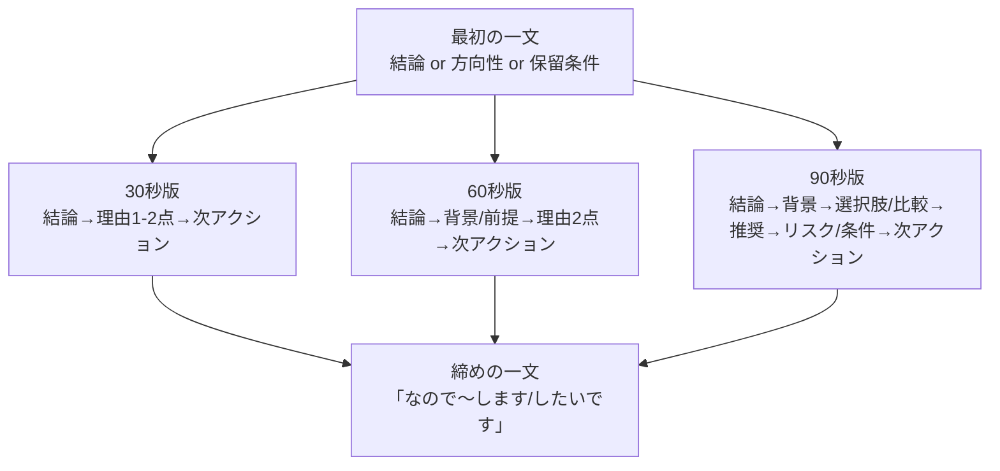
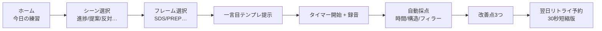

# 会議で急に話を振られたときの即答力を鍛える手法

- 作成日: 2026-04-11 16:30 JST
- 作成者: Codex (GPT-5)
- 更新日: 2026-04-11

## エグゼクティブサマリ

会議で「急に話を振られる」場面は、**時間制約（秒単位）＋社会的ストレス＋情報処理（論点抽出・検索・構造化・発話）**が同時に発生し、作業記憶（ワーキングメモリ）の容量と注意資源を一気に消費します。作業記憶は「保存（保持）」と「処理（思考・制御）」で取り合いになる有限の作業領域として捉えられており、容量制約が前提です。citeturn9view0 さらに、注意が別作業に占有される時間が増えるほど“認知負荷”が上がり、保持や処理の成績が落ちるという時間ベースの枠組みも示されています。citeturn25view0 そして急性ストレスは反応時間や正答率などの作業記憶パフォーマンスを低下させうることが、TSST（社会的ストレス課題）×n-back課題の研究で示されています。citeturn17view0

したがって「即答力」を実務会議向けに鍛えるには、精神論よりも **(1) 認知負荷を下げる型（フレーム）を固定化して“最初の一文”を自動化**し、**(2) 時間制約下でも崩れない“答案設計（30/60/90秒）”を持ち**、**(3) 反復練習（deliberate practice/ retrieval practice）で検索と構造化の速度を上げ**、**(4) 計測→フィードバック→再試行のループ**を回すのが最短です。テスト（想起）そのものが長期保持を強めうる「テスティング効果」も知られており、即答訓練を“想起練習”として設計する根拠になります。citeturn37view1 また、ストレス下の作業記憶低下が、一定期間の認知トレーニングで予防されうる可能性も示されています。citeturn36view1

本レポートは、目的である  
- 「数秒で論点を整理し、崩れずに答える技術」  
- 「“考え中です”が長くなる問題を減らし、最初の一文を強くする」  
を満たすために、**思考フレーム、時間制約下トレーニング、会議・面接の即答訓練、認知負荷が高い場面での反射訓練、30/60/90秒設計、音声アプリ事例、評価指標**を、反復可能な訓練体系に落としたものです。  

無指定：対象業界、職位、会議の言語（日本語/英語）、会議形態（対面/オンライン）、会議の頻度、想定する質問タイプの比率（報告/提案/意思決定/炎上対応など）、評価のベンチマーク（社内標準・上長期待値）、トレーニング期間（何週間やるか）、投入可能な学習時間（1日何分か）。

## 即答力の構成要素

即答力は「早口で話せる」ではなく、**“注意資源が枯渇しやすい条件下でも、結論→根拠→次アクションを最小で組める能力”**です。作業記憶の有限性citeturn9view0と、注意占有時間が認知負荷を決める枠組みciteturn25view0、ストレス下で作業記憶が落ちうる知見citeturn17view0を踏まえると、構成要素は次のように分解できます。

| 要素 | 短説明（会議向け） | なぜ重要か（負荷の観点） |
|---|---|---|
| 論点固定 | 質問を「何を決めたい/何を確認したい」形に言い換えて、争点を1つに絞る | 争点が多いほど保持＋処理が並走し、注意資源を圧迫する（有限性）。citeturn9view0turn25view0 |
| 結論の暫定化 | 完璧な結論でなくても「現時点の判断」を先に置く（Yes/No/方向性/保留条件） | “考え中”を長引かせると、時間制約で負荷が増える。citeturn25view0 |
| 構造化（型） | SDS / PREP / WHAT–SO WHAT–NOW WHAT 等で3〜4ブロックに分ける | 型があると“次に何を言うか探索”が減り、余計な認知負荷（extraneous）を下げられる。citeturn35view0turn28view2turn30view1 |
| 根拠の最小提示 | 根拠は「2点まで」「数字/具体例1つ」など、短時間用に圧縮する | 情報量が増えるほど保持が膨らみ、処理が遅れる。citeturn9view0turn25view0 |
| 前提・不確実性の制御 | 知らない点は「前提」「確認事項」「見込み」で分離し、保留の条件を明示 | “答えない”ではなく“答え方を決める”。ストレス下での不確実性処理を簡略化。citeturn17view0turn36view1 |
| 次アクション化 | 「決めたいこと」「提案」「次に取る行動（誰が/いつまで）」で締める | 会議は行動の場。終点があると話が散らばりにくい。citeturn30view1 |
| 時間設計 | 30/60/90秒で“入れる要素”を固定し、長さを守る | 時間が短いほど設計が必要。30〜60秒（最大90秒）で複数版を用意する発想はエレベーターピッチでも推奨。citeturn31view1 |
| 発話の衛生（フィラー/間/速度） | 「えーと」「あの」等のフィラー、詰まり、過剰な自己修正を抑える | フィラー過多は理解度低下の要因になりうる。citeturn26view2 また、フィラー・速度・間はアプリ等で計測・フィードバック可能。citeturn32view0turn32view3turn32view4 |

## すぐ使える回答フレーム

### 30/60/90秒の回答設計

「話の内容があるのに最初が出ない」問題は、**“内容生成”ではなく“構造選択”に時間を使っている**ケースが多いです。ここを固定化します（エレベーターピッチでは30–60秒、長くても90秒にまとめる考え方が示されています）。citeturn31view1

citeturn31view1

この設計は、“長く話せる人”ではなく“短い枠で崩れない人”を作ります（時間制約が強いほど、注意資源が占有されやすく負荷が上がるため）。citeturn25view0

### 回答フレーム早見テンプレート表

以下は、会議で頻出の「答える型」を、用途・長さ・一言目テンプレまで含めて整理した表です（実務資料側の代表例としてPREP/SDS/DESCが整理されています）。citeturn28view3turn28view2

| フレーム | 適用シーン（会議中心） | 30/60/90秒の使い分け | “最初の一文”テンプレ（そのまま使える） | 根拠（出典） |
|---|---|---|---|---|
| SDS（要点→詳細→要点） | 進捗報告、状況共有、忙しい上司への報告 | 30秒: 要点→理由/事実→要点 60秒: 詳細を少し増やす 90秒: 詳細を整理して増やす | 「結論（要点）は◯◯です。根拠（事実）は2点で、最後に次の打ち手を言います。」 | entity["company","GLOBIS","business education company"]によるSDS説明/適用例。citeturn28view2 |
| PREP（結論→理由→具体例→結論） | 意見表明、提案、合意形成の入口 | 30秒: 具体例は1つ 60秒: 具体例＋補足 90秒: 反論対応まで | 「結論から言うと◯◯です。理由は2点で、最後に一例を添えます。」 | entity["company","Schoo","online training platform"]やentity["company","Kaonavi","hr SaaS firm"]の解説。citeturn28view0turn28view1 |
| DESC（描写→説明→提案→選択） | 反対意見、課題提起、依頼・交渉 | 60秒以上が安定。30秒は短縮版で「現状→提案→選択」 | 「状況は◯◯で、課題は◯◯です。提案はAで、選択肢はA/Bです。」 | entity["company","Ｓｋｙ株式会社","japan software firm"]の整理。citeturn28view3 |
| What? / So what? / Now what? | 即席の説明、意見、議事メモからの要約 | 30秒: What→Now what（短縮） 60秒: 3点フル 90秒: So whatを厚く | 「事実（What）は◯◯です。重要性（So what）は◯◯で、次（Now what）は◯◯です。」 | entity["organization","Toastmasters International","public speaking nonprofit"]の記事で例示。citeturn30view1 |
| STAR（状況→課題→行動→結果） | 面接、振り返り、成果報告、トラブル対応の説明 | 60〜90秒向き（状況を短く） | 「状況は◯◯、課題は◯◯でした。私の行動は◯◯で、結果は◯◯です。」 | entity["company","Indeed","job search company"]の解説。citeturn31view0 |
| ピラミッド（結論→根拠の束→詳細） | 上位者へ短時間で提案、論点が多い意思決定 | 30秒: 結論＋根拠の束だけ 60秒: 根拠の束をMECEに 90秒: 選択肢比較も | 「結論は◯◯です。根拠は3つで、同列に並べて説明します。」 | entity["people","Barbara Minto","pyramid principle author"]とentity["company","McKinsey & Company","management consulting firm"]の紹介（MECE/ピラミッド原則）。citeturn29view0 |

補足：上表の「ピラミッド」は、書籍entity["book","The Minto Pyramid Principle","minto 1996 edition"]で知られる“上位が下位の要約であるべき”という考え方が土台です。citeturn29view0

### 準備時間短縮法（会議用の“即答在庫”を作る）

準備時間短縮の本質は、**その場の生成を減らし、想起（取り出し）で答える比率を増やす**ことです。想起テストが将来の保持を高める（テスティング効果）ため、日常会議で繰り返し出る質問は“想起で即答できる形”にしておくのが合理的です。citeturn37view1

実務で効く最小手順は次の3段階です（面接練習の基本として「イメージ→書く→声に出す」という段階設計が紹介されています）。citeturn31view2  
1) **質問の型を10個に分類**（例：進捗、リスク、意思決定、提案、反対、優先順位、見積り、顧客、品質、次アクション）  
2) 各型に**固定フレーム**を当てる（例：進捗＝SDS、提案＝PREP、反対＝DESC）citeturn28view3turn28view2  
3) 各型について**30/60/90秒の3バージョン**を作り、声に出して調整（録画が有効）。citeturn31view2turn31view1

### 一言目テンプレート（“考え中”を短くし、最初の一文を強くする）

「考え中です」を長引かせる代わりに、最初の一文で**“回答モード”を宣言**し、負荷の高い処理（探索）を後ろに回します（注意が占有されるほど負荷が上がるため、“最初の一文で枠を作る”のが有利）。citeturn25view0

| 目的 | 一言目テンプレ（会議でそのまま） | 続ける型 |
|---|---|---|
| 結論がある | 「結論から言うと◯◯です。」 | PREP / SDSciteturn28view2turn28view3 |
| 結論は暫定 | 「現時点の判断は◯◯寄りです。理由は2点あります。」 | PREP短縮 |
| 保留したい（条件付き） | 「今ここで断定は難しいので、前提を1点確認してから結論を言います。」 | What/So what/Now what短縮citeturn30view1 |
| 質問を整理する | 「質問は“◯◯を決めたい”という理解で合っていますか？」 | 論点固定→SDS |
| 反対・懸念を出す | 「懸念は◯◯です。理由と代案をセットで述べます。」 | DESCciteturn28view3 |
| すぐ次アクションに落とす | 「結論は◯◯、次の一手は◯◯です。」 | Now what先出しciteturn30view1 |

## 訓練メニュー

即答力は「知識」よりも「再現性ある反復」で伸びます。専門技能の獲得には、意図的な練習量が重要であるという立場（deliberate practice）もあり、訓練は“回数・フィードバック・難易度調整”を前提に設計します。citeturn11view0 さらに、想起（テスト）自体が保持を強めるという知見を使い、Q&Aを“想起練習”にします。citeturn37view1

以下の10メニューは、会議中心に最適化し、**目的→手順→頻度→所要時間→評価**を固定しました（評価は後述の測定指標へ接続）。

| メニュー | 目的 | 手順（反復可能な形） | 頻度 | 所要時間 | 評価方法（具体） |
|---|---|---|---|---|---|
| フレーム即選択ドリル | “型を選ぶ迷い”を消す | ①質問カードを引く（進捗/提案/反対など）②2秒以内に「使うフレーム名」を宣言③30秒で回答④録音 | 毎日 | 8分 | 選択時間（秒）、30秒遵守率、構造スコア（各要素有無） |
| 30秒結論先出し | 最初の一文を自動化 | ①質問→②「結論から言うと…」で開始③理由2点まで④次アクションで締め | 週5 | 10分 | 反応開始ラグ（秒）、結論先出し率、余計語（フィラー）/分 |
| 60秒“背景→理由→次” | 論点の最小背景を付ける | ①結論②背景/前提を1つ③理由2点④次アクション | 週3 | 12分 | 背景の一貫性（定性）、聞き手理解度（5段階） |
| 90秒“選択肢比較” | 意思決定会議の即答 | ①結論（推奨）②選択肢A/Bの比較軸2つ③リスク/条件④次アクション | 週3 | 15分 | 比較軸の明確さ、逸脱回数、意思決定につながる度合い |
| Table Topics式ランダム即答 | 予測不能性に慣れる | ①ランダムなお題（仕事要約/意見/説明）②1〜2分で話す③録音④翌日同じお題を30秒で再回答 | 週2 | 15分 | 1〜2分の構造（導入/本体/締め）、フィラー減少 | 
| ストレス模擬（軽負荷） | 認知負荷高場面で崩れない | ①タイマー＋カメラON（自己観察）②“早く答えて”と促す音を入れる③短答（30/60）④終わったらNASA-TLX簡易自己評価 | 週2 | 10分 | NASA-TLX（主観負荷）6尺度citeturn37view0、反応開始ラグ |
| 二重課題（注意占有）即答 | 注意が奪われても論点を保つ | ①簡単な作業（数字逆唱/簡単計算）を挟む②その直後に会議質問へ30秒回答③録音 | 週2 | 12分 | 内容崩壊率、言い直し回数、要点保持率 |
| 面接→会議転用STAR | エピソード回答の骨格を自動化 | ①よくある“修羅場”質問を用意②STARで60〜90秒回答③最後に会議向けに「次アクション」へ変換 | 週2 | 15分 | STAR要素の欠落数、会議向け翻訳の明確さciteturn31view0 |
| フィラー可視化改善 | フィラー癖を減らす | ①2〜3分スピーチを録音②フィラー数・分布を可視化③「間（pause）に置き換える」再試行④4回繰り返し | 週2 | 20分 | フィラー/分、フィラー集中区間、改善率（初回比） |
| 会議ログ再演（最短化） | 実務そのものから学ぶ | ①直近会議で詰まった質問を1つ選ぶ②30/60/90版を作る③翌日、同質問をランダム投入して録音④週末にまとめて評価 | 週1（まとめ）＋毎日1本 | 週60分 | “考え中”の秒数、再質問回数、次アクション提示率 |

訓練メニューの設計根拠（要点）：  
- 即答は「準備→本番」ではなく「想起→修正→再想起」の繰り返しにすると、想起練習として蓄積されやすい（テスティング効果）。citeturn37view1  
- 時間制約が強いほど、注意が占有され認知負荷が上がり、保持・処理が落ちやすいので、**時間制約を前提にした練習**が必要。citeturn25view0  
- 急性ストレスが作業記憶を低下させる可能性があり、ストレス近似（軽度）下での練習が「本番耐性」につながる。citeturn17view0turn36view1  
- 即興スピーチの反復が、思考の整理やフィラー減少に寄与しうるという実務トレーニングの示唆（Table Topics）。citeturn30view0turn30view1

### 訓練スケジュール表（4週間・会議中心の最小実装）

無指定：ユーザーの可処分時間が未指定のため、**平日1日10〜15分＋週末45分**で組みました（負荷を上げたければ各枠を倍にします）。

| 週 | 平日（毎日） | 週2回（任意日） | 週末（45分） | 期待成果 |
|---|---|---|---|---|
| 1 | 30秒結論先出し（10分） | フレーム即選択（8分） | 会議ログ再演（45分） | “最初の一文”の固定化 |
| 2 | 30秒＋60秒（交互） | フィラー可視化改善 | 指標計測（ベースライン更新） | 30秒の崩れ減少 |
| 3 | 60秒中心（背景→理由→次） | 二重課題即答／ストレス模擬 | 90秒“選択肢比較”まとめ | 負荷下の安定化 |
| 4 | ランダム即答（30/60/90混在） | 面接→会議STAR転用 | 本番想定ミニ模擬会議（録画） | 実会議への転移 |

## 測定指標

「即答力」は主観で語られがちなので、**定量×定性**をセットにして改善の方向を固定します。認知負荷は主観尺度で測る方法が一般的に用いられ、NASA-TLXは代表例の1つです（6尺度）。citeturn37view0turn7view0 また、音声特徴（話速、間、韻律、フィラー等）は認知負荷と関連しうるという研究・実装例があり、計測・分類の対象になっています。citeturn25view0turn26view0turn26view2

### 定量指標（例）

| 指標 | 測定方法 | 目標値例（実務会議） | ねらい |
|---|---|---|---|
| 反応開始ラグ（秒） | 質問終了〜最初の意味のある語（結論/前提確認）までを録音で計測 | 30秒回答：2秒以内 60秒：3秒以内 | “考え中”の長期化を削る（時間占有を減らす）。citeturn25view0 |
| 30/60/90秒遵守率 | タイマーで測定（±5秒以内を成功） | 30秒：80% 60秒：70% 90秒：60%（開始時）→改善 | 時間制約下の設計を身体化。citeturn31view1 |
| 構造スコア（0〜10） | フレーム要素の有無を採点（例：PREPならP/R/E/P） | 平均8/10以上 | “崩れない”を可視化。citeturn28view2turn30view1 |
| フィラー数/分 | 音声→文字起こし→フィラー辞書でカウント（手動でも可） | 50%削減→最終は“会議で気にならない”水準 | 理解度低下の要因になりうるフィラーを抑える。citeturn26view2turn32view4 |
| 言い直し回数 | 「つまり…」「違う」等の自己修正をカウント | 30秒回答で0〜1回 | 思考の迷走・構造崩壊の代理指標。citeturn25view0 |
| 次アクション提示率 | 終了時に「誰が/いつまで/何を」が出た割合 | 60%→80% | 会議の前進度を上げる。citeturn30view1 |

### 定性指標（例）

| 指標 | 測定方法 | 目標値例 | ねらい |
|---|---|---|---|
| 主観負荷（NASA-TLX簡易） | 6尺度を各1〜7で自己評価（Mental/Temporal/Performance等） | Temporal DemandとFrustrationを段階的に下げる | 高負荷の正体を分解。citeturn37view0turn7view0 |
| 聞き手の明確度 | 同僚/上長が「要点が分かったか」を5段階評価 | 平均4.0以上 | 即答は“短い説明”ではなく“伝達”。 |
| “再質問”発生率 | 発言後に追加確認が必要だった頻度 | 低下傾向を作る | 論点固定と構造化の実務効果を見る。 |
| 自己効力感 | 本番直後に「次も同様にできそうか」 | 週次で上昇 | 状態依存（ストレスに弱い）を減らす。citeturn36view1 |

## アプリ化アイデア

### 音声トレーニングアプリ事例から抽出できる設計要素

音声トレーニング系は「録音→分析→即時フィードバック→進捗可視化」を中核にしています。たとえばentity["company","Orai","ai speech coach app"]は録音音声を分析し、フィラーや話速などへの即時フィードバックと進捗トラッキングを掲げています。citeturn32view0 entity["company","Poised","ai communication coach"]はオンライン通話中のリアルタイムフィードバック（フィラー等）や、改善対象を絞る“メーター”設計を示しています。citeturn32view1 entity["company","Speeko","ai speech coach app"]も話速・抑揚・語の選び方などの分析と、フィラー回避の示唆を提示しています。citeturn32view3 entity["company","Yoodli","ai roleplay speech coach"]はロールプレイ型の練習（面接やピッチ等）を前面に出しています。citeturn32view2

日本語UIで「会議・面接・プレゼン」などシーン練習をうたう例として、entity["company","Babli","ai public speaking coach"]（シナリオ録音→フィラー削減や明快さのフィードバック等）があり、会議カテゴリも含めたロールプレイを示しています。citeturn32view4 entity["company","SayNow AI","speaking practice app"]は面接・プレゼン等のシナリオと、STARやPyramid Principle等の枠組み搭載を特徴として掲げています。citeturn32view5

企業研修寄りでは、entity["company","UMU","ai learning platform"]がAIによるリアルタイムフィードバックや反復練習支援を記載し、スピーチ評価モデルやシナリオと組み合わせた改善提案を示しています。citeturn32view7turn33view1 また、国内の話し方診断・トレーニングとしてentity["company","kaeka","japan speech training"]の「kaeka score」（AI＋専門家視点で話す力を数値化、フィラー検出追加など）が公表されています。citeturn34view0turn39view0

### 会議の即答力に特化したアプリの機能一覧（提案）

以下は「会議で急に振られた時の即答」用途に最適化した、アプリ仕様案です（設計案＝提案であり、未実装）。

機能は“認知負荷を下げる（extraneousを減らす）”方向に寄せます。認知負荷理論では、余計な負荷を下げ、学習に資する負荷へ注意を向ける設計が望ましいと整理されています。citeturn35view0

**コア機能（MVP）**
- シーン別質問バンク（進捗、意思決定、リスク、反対意見、見積もり、優先順位、顧客対応など）
- 30/60/90秒タイマー（開始合図・残り5秒合図）
- フレーム選択UI（SDS/PREP/DESC/What-So what-Now what/STAR）
- 一言目テンプレ自動提示（押すだけで画面に表示）
- 録音＋自動文字起こし（会議後の振り返りにも転用）
- 指標スコアリング（反応開始ラグ、時間遵守、構造スコア、フィラー/分、言い直し回数）

**差別化機能（会議特化）**
- 「論点固定」ガイド（質問を“決めたいこと”に変換するウィザード）
- “保留の型”支援（前提確認→暫定判断→確認TODOの3点セット）
- 会議モード（リアルタイムは慎重：プライバシー設計必須。実装するならPoisedのように本人だけ見える設計思想が参考）citeturn32view1turn40view0
- 学習モード（復習）：同じ質問を翌日に短縮版で再回答＝想起練習（テスティング効果の活用）citeturn37view1

### UXフロー（提案）

citeturn37view1turn35view0

### 練習モード（提案）

- ランダムQ（会議の“急な振り”再現）
- 30秒モード（結論先出し固定）
- 60秒モード（背景→理由→次）
- 90秒モード（選択肢比較＋リスク条件）
- ストレス模擬モード（タイムプレッシャー＋視線圧）  
- フィラー矯正モード（フィラー箇所を可視化して再録音）
  - フィラー可視化・練習支援は研究・実装例があり、検出精度や練習効果評価も報告されています。citeturn26view2

### フィードバック設計（提案）

“改善点を全部出す”と認知負荷が増えるため、**一度に直す項目は2〜3個**に制限します（Poisedの「メーターを選んで少数に絞る」思想が参考）。citeturn32view1

- 構造フィードバック：欠けている要素（結論/理由/次アクション等）を最優先で警告
- 時間フィードバック：タイムオーバー箇所（どこで長くなったか）
- 言語フィードバック：フィラー・冗長表現・言い直し
- 進捗：週次で「反応開始ラグ」「時間遵守率」「構造スコア」「フィラー/分」をトレンド表示
  - これらは既存アプリが明示する分析観点（フィラー、話速、明確さ等）と整合。citeturn32view0turn32view3turn32view4

### マネタイズ案（提案）

- Freemium：無料＝1日3問＋基本指標、Pro＝質問バンク拡張＋会議モード＋履歴分析
- Team版：部署ごとの“会議即答”共通質問セット、匿名化した指標ダッシュボード
- 研修連携：UMUのように「課題配信→提出→フィードバック→反復」の研修運用に接続（ただし会議特化の指標に寄せる）。citeturn33view1turn32view7

## 参考情報源カテゴリ

優先する一次情報源（原著・公式）を中心に、今回の設計に直結するカテゴリを整理します。

認知心理学・認知負荷の一次情報源は、作業記憶の有限性（Baddeley & Hitch, 1974）citeturn9view0、認知負荷理論（Sweller, 1988/2011）citeturn8view0turn35view1、時間制約と注意資源（Barrouilletら, 2007）citeturn25view0が軸になります。ストレスと実行機能（特に作業記憶）については、TSST×n-backの実験研究や、トレーニング介入研究（Schoofsら, 2008；Loock & Schwabe, 2024）が会議の“急な振り”に近い条件を含みます。citeturn17view0turn36view1

訓練設計の一次情報源としては、意図的練習（deliberate practice）に関する体系的議論（Ericssonら）citeturn11view0と、想起練習（テスティング効果）（Roediger & Karpicke, 2006）citeturn37view1が、反復可能な訓練に落とすための理論軸です。

実務向けフレームは、日本語の企業向け教育・実務記事で整理されたPREP/SDS/DESCの適用場面が、会議での即時運用に直結します。citeturn28view2turn28view3turn28view1 面接での即答訓練はSTAR法や練習プロセス（想定→書く→声に出す）などが、会議にも転用できます。citeturn31view0turn31view2

音声計測・フィラー領域は、フィラー検出と練習支援システムの報告（可視化と練習での改善）citeturn26view2や、音声特徴と認知負荷の関係を扱う研究（ポーズ、韻律、話速など）citeturn26view0が一次寄りです。主観負荷評価の代表例としてNASA-TLXの尺度説明（公式PDF）を参照できます。citeturn37view0turn7view0

音声トレーニングアプリの公式情報源は、各プロダクトの公式サイト・公式ストア記載を優先し、収録指標（フィラー、話速、明快さ等）やロールプレイUX（面接/会議/プレゼン）を抽出し、会議即答へ再設計します。citeturn32view0turn32view1turn32view3turn32view4turn33view1turn39view0

a. あなたの実際の会議（質問タイプ比率：進捗/提案/反対/意思決定など）に合わせて、30/60/90秒の「回答カード」を30枚に圧縮した運用設計  
b. 上の測定指標を使う「評価シート」（Excel想定）の採点ルーブリック案（構造スコア、ラグ計測、フィラー記録）  
c. 1日10分・4週間のスケジュールを、あなたの会議頻度（無指定）に合わせて再配分したカスタム版  
d. アプリ化アイデアをPRD（要件定義）形式に落とし込み（MVP範囲、イベント設計、指標設計、データ・プライバシー方針）  
e. 会議向けランダム質問100件（カテゴリ別）＋各質問の「一言目テンプレ」セット作成
