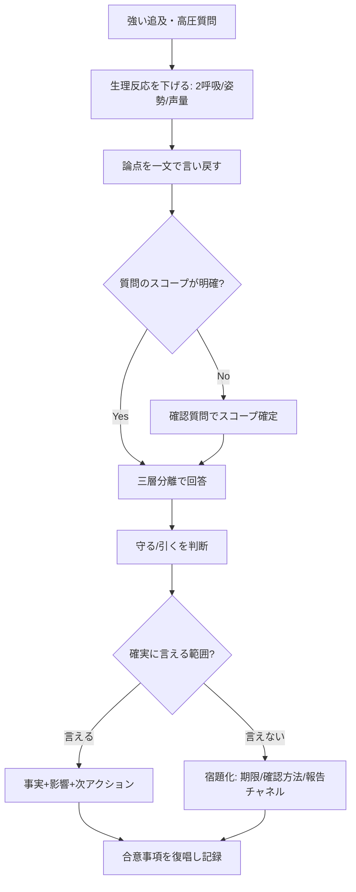
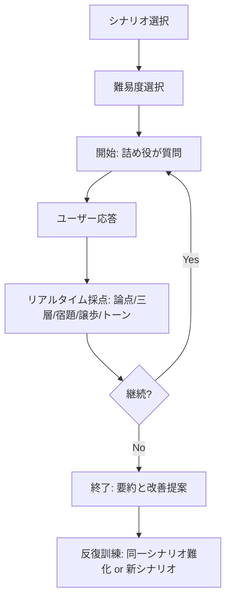

# 日本語の職場コミュニケーションにおける「詰め」対応の防御技術

- 作成日: 2026-04-11 16:30 JST
- 作成者: Codex (GPT-5)
- 更新日: 2026-04-11

## エグゼクティブサマリ

本稿は、日本語の職場コミュニケーションにおいて「厳しく詰められる」局面（強い追及・感情的圧力・高圧質問）でも、論点を見失わずに応答し、**不用意な失言・不用意な譲歩・不必要な自己否定**を減らすための実務技術を体系化する。前提として、職場での追及は「説明責任（アカウンタビリティ）の要求」として正当な場合もある一方、**人格否定や不相当な叱責が反復される局面はハラスメント問題に接続し得る**ため、コミュニケーション技術と同時に“境界線”も設計する必要がある。citeturn9view0turn9view1turn20view0turn2search3

結論として最も再現性が高いのは、会話を「上手に返す」より先に、**会話の構造（論点・層・合意）をこちらが握る**こと。具体的には次の6点が核になる。  
(1) **論点固定**（何を問われているかを一文で言い戻し、スコープを確定）  
(2) **三層分離**（事実／解釈／見通し＝宿題化を分け、確実性の境界を明示）  
(3) **守る主張と引く主張の判定**（事実確度・法務/安全・約束可能性・代替案（BATNA）で判断）  
(4) **反論処理と質問返し**（相手の“感情・評価”を受け止めつつ、事実と手順に戻す）  
(5) **防御的に見えない言い回し**（傾聴・アサーション・自己一致で“協力姿勢”を保つ）  
(6) **緊張下の訓練**（呼吸法＋認知リハーサル＋ロールプレイ＋振り返りで自動化）citeturn12view0turn11view0turn11view1turn9view5turn15view0

「三層分離」は、認知行動療法（CBT）で重視される**“客観的事実”と“解釈（思い込み）”の区別**を職場説明に移植し、さらに不確実領域は**宿題（期限・確認方法つき）として切り出す**運用で安定する。citeturn9view7turn8view0turn11view1

---

## 詰め対応の原則

### 局面を見誤らないための前提

職場の「詰め」は、しばしば(1)原因究明、(2)再発防止、(3)責任所在、(4)納期・顧客影響、(5)組織ルール順守の確認が混線する。混線が起きると、質問の形をした“評価”や“断定”が増え、こちらが反射的に謝罪・自己否定・過剰約束へ流れやすい。そこで最初にやるべきは**論点の交通整理**である。citeturn11view1turn10view1turn20view0

また、追及が「指導の範囲」を超え、人格否定や過度な叱責が反復される場合は、会話技術だけで解決しない。法令・指針上、職場のハラスメント対策は事業主の義務で、相談・事実確認への協力等を理由とする不利益取扱いの禁止なども示されているため、**“会話で耐える”以外の経路（記録・相談・手続）**を設計しておくことが安全側になる。citeturn9view1turn20view0turn2search3

### 即時に効く「詰め対応アルゴリズム」

詰め局面では「頭が真っ白」「何を考えていたか覚えていない」が起き得るため、**先に身体反応を下げてから言語処理に入る**のが合理的である（“頭が真っ白”の扱いを含めたCBTの実務記述がある）。citeturn9view5turn9view6turn8view0turn11view1

### 三層分離の定義と運用

本稿の三層分離は次の通り。

- **事実（Fact）**：観測・記録・数字・時系列で検証可能な情報（「見た/聞いた/ログ/資料」）。  
- **解釈（Interpretation）**：原因推定、評価、責任、意図推定（「〜だと思う」「〜のはず」）。  
- **見通し（Outlook）＝宿題化（Homework）**：現時点で断定できない部分を、確認手順・期限・報告方法つきで切り出した“次の確実性”。citeturn9view7turn11view0turn11view1

この区別は、CBTで「根拠には客観的事実を書く（思い込みや事実の解釈は避ける）」といった形で明示されており、職場説明でも同じ誤差源（推測での断定、相手の心の読み）が事故を生む。citeturn9view7turn8view0

三層分離を“詰め対応”にするコツは、**解釈を消すのではなく、解釈を“扱う順番”に落とす**こと。つまり「解釈の議論は後段（再発防止や責任の議題）に送る」か、「解釈は仮説として扱い、検証計画（宿題）とセットにする」。citeturn11view1turn20view0

### 守るべき主張と引くべき主張の判断基準

守る／引くは“精神論”ではなく、**交渉・合意形成の設計**として切り分けると判断が安定する。ハーバード型交渉法の整理では、合意不成立時の最善代替案（BATNA）を準備し、ボトムラインと区別することが強調される。citeturn19view0

職場の詰め局面に落とすと、判断基準は次の4軸が実務的である。

- **真実性（事実確度）**：確実な事実は守る／不確実は“宿題化”へ送る（推測で守らない）。citeturn9view7turn11view1  
- **規範性（法務・安全・コンプライアンス）**：違法/危険に接続する譲歩はしない（“その場で飲む”より“手続きに乗せる”）。citeturn2search3turn9view0turn20view0  
- **約束可能性（実行可能性）**：期限・工数・権限が揃わない約束はしない（代わりに“確認計画つきの回答”を出す）。citeturn11view1turn20view0  
- **代替可能性（BATNA/選択肢）**：こちらに代替案・選択肢があるほど、過剰譲歩を避けやすい（「AがだめならB」）。citeturn19view0turn11view0  

この4軸で整理すると、「謝るべきか」も分解できる。**事実の誤り**には謝罪が適切だが、**解釈（評価や意図）**まで一括で引き取ると、不必要な自己否定・責任固定に繋がる（＝不用意な譲歩）。citeturn11view0turn9view7turn20view0

### 実務的チェックリスト

下表は、詰められた瞬間から会話を閉じるまでの「最低限の守り」を、チェックとして扱える形にしたもの。

| フェーズ | 目的 | 具体行動（最小セット） | 失敗しやすい点 |
|---|---|---|---|
| 入口 | 反射を止める | 呼吸2回＋姿勢固定、声量を1段落とす。必要なら「確認して答えます」を先に置く。 | 早口・言い訳口調で情報過多になる |
| 論点固定 | 何に答えるか確定 | 「いま問われているのはAで合っていますか？」を一度入れる。 | “全部に答える”に入って発散 |
| 三層分離 | 断定の事故を防ぐ | 「事実は〜、解釈は〜（仮説）、見通し/宿題は〜」と分ける。 | 推測を事実のように言う |
| 守る/引く | 不用意な譲歩を防ぐ | 事実確度・規範・約束可能性・代替案で即判定。 | 謝罪で責任まで固定する |
| 宿題化 | 不確実を安全に扱う | 宿題の“期限・確認方法・報告先”を必ず言語化。 | 「確認します」で終わって不信になる |
| 収束 | 信頼を残す | 合意点を復唱し、記録（メール/議事）化を宣言。 | うやむやで終わる／認識齟齬が残る |

このチェックリストは、アサーティブ・コミュニケーション（DESC法）での「客観→感情→提案→選択肢」構造や、問題解決手順（課題設定〜計画〜評価）と整合する。citeturn11view0turn9view2turn11view1turn10view1

---

## 使える切り返しパターン

### 使い回せるテンプレ表

下表は、詰め局面で“言い返す”ためではなく、**論点・確実性・合意**をこちらが握るためのテンプレである（状況に合わせて語尾の丁寧さだけ調整する）。

| 目的 | 使う場面 | 切り返しテンプレ（日本語） | 効果の狙い |
|---|---|---|---|
| 論点固定 | 話が発散 | 「論点を1点に絞ると、“いま確認したいのはA”で合っていますか。」 | 複数追及を分解 |
| スコープ確認 | 質問が曖昧 | 「“どの範囲”の話でしょうか。今日の作業分/今週/リリース全体、どれですか。」 | 誤答防止 |
| 三層分離の宣言 | 追及が強い | 「事実・解釈・見通しの順で整理してお答えします。」 | 構造を握る |
| 事実提示 | まず事実だけ言う | 「事実として確認できているのは、(日時/数値/状態)が〜です。」 | 推測混入を防ぐ |
| 解釈を仮説化 | 原因を迫られる | 「原因は現時点では仮説が2つあります。AとBで、確認すべき点は〜です。」 | 断定を回避 |
| 宿題化 | 断定できない | 「その点は即答できません。確認手順は〜で、◯時までにお返しします。」 | “逃げ”に見せない |
| 部分肯定 | 相手が感情的 | 「ご懸念はもっともです。まず事実関係を揃えた上で、再発防止を提案します。」 | 対立を下げる |
| 評価と事実を分離 | 「お前のせい」系 | 「責任論の前に、事実として何が起きたかを揃えたいです。時系列を話します。」 | 早期の責任固定を防ぐ |
| 反論の受け止め | 否定される | 「受け止めます。その前提の“〜”は、事実としてどの情報を根拠にされていますか。」 | 争点を“根拠”へ戻す |
| 質問返し（意図確認） | 質問が攻撃的 | 「ご質問の意図は、原因究明と再発防止のどちらが主でしょうか。」 | “目的”を固定 |
| 基準の要求 | 評価が恣意的 | 「良い/悪いの判断基準を確認したいです。判断軸は（納期/品質/手順）どれですか。」 | 客観基準へ寄せる |
| 選択肢提示 | 詰めが止まらない | 「現実的な選択肢はA（◯日/品質◯）とB（△日/品質△）です。どちらを優先しますか。」 | BATNA/オプション化 |
| 感情の扱い | 声を荒げられる | 「不快にさせた点は申し訳ないです。内容の確認に戻すと、〜です。」 | 防御的に見せず復帰 |
| “協力姿勢”の可視化 | 疑われている | 「隠す意図はありません。確認できた事実から順に共有します。」 | 信頼の維持 |
| 時間稼ぎ（上品） | 即答要求 | 「正確性のために数字を確認します。5分/今日中に整理して報告します。」 | 失言防止 |
| 記録モード | 言質が怖い | 「認識齟齬が怖いので、いまの前提と合意を私の言葉で復唱してよいですか。」 | 後日の争点化を防ぐ |
| 境界線提示 | 人格否定/罵倒 | 「業務の改善には協力します。一方で、人格に関わる表現は避けて進めたいです。」 | 防御過多を避けた防衛 |
| 退出/延期 | 危険水域 | 「このままだと冷静に整理できません。10分後に再開/別枠で事実確認の場をください。」 | 事故を止める |
| クローズ | 終了前に固定 | 「本日の合意はA、宿題はB（期限◯時）です。認識違いがあれば今ここで直します。」 | 論点固定で終える |

これらは、(a)傾聴（相手の意図・基準を確認し、評価を入れずに聴く）、(b)アサーティブ（客観→感情→提案→選択肢＝DESC）、(c)問題解決（課題設定→案出→計画→評価）という再現性の高い枠組みを、詰め局面向けに言語化したものである。citeturn12view0turn11view0turn11view1turn9view2

---

## 危険な返答例と改善例

下表は、「詰められている時ほど言いがちだが危険」な返答と、同じ内容を**信頼を落とさず防御的に運ぶ**改善例である。危険性の中心は、(1)事実と解釈の混同、(2)不確実領域の断定、(3)過剰謝罪による責任固定、(4)約束可能性のないコミット、に集約される。citeturn9view7turn11view0turn19view0turn20view0

| 危険な返答 | 何が危険か | 改善例 | 改善のポイント |
|---|---|---|---|
| 「全部私が悪いです」 | 事実未確定でも責任を固定し、後で撤回できない | 「まず事実関係を揃えます。私の作業分の事実は〜です。原因は確認して報告します」 | 責任論を後段へ送る |
| 「たぶん〜だと思います」 | 推測が事実扱いされる | 「現時点では仮説です。根拠は〜で、確認が必要な点は〜です」 | 解釈を仮説化＋検証 |
| 「言い訳になりますが…」 | 自分で“防御”を宣言してしまう | 「背景として条件が2点あります。A、Bです。その上で対応は〜します」 | 背景を“情報”として提示 |
| 「そんなの聞いてません」 | 事実でも対立を増やす | 「締切の認識がズレていた可能性があります。現在の認識は〜でした。合意を取り直したいです」 | 争点を認識合わせへ |
| 「今すぐやります！」 | 実行可能性不明の過剰約束 | 「最短で◯時に一次版、品質担保のために△時に最終版が現実的です」 | オプション提示で誠実に |
| 「相手（他部署）が悪いです」 | 人間関係を破壊し、解決から遠ざかる | 「依存関係がありました。こちらの手当として〜、相手側の確認は宿題で〜です」 | 構造（依存）として扱う |
| 「すみません（連呼）」 | 謝罪が“結論”になり、説明が崩れる | 「ご迷惑をかけた点は申し訳ないです。事実としては〜、次の打ち手は〜です」 | 謝罪は1回、後は事実と手順 |
| 「違います！（即否定）」 | 相手の面子を潰して激化 | 「その見え方になる点は理解します。事実としては〜で、誤解があればここが境目です」 | 受容→事実→境界 |
| 「いや、怒鳴られても…」 | 感情の応酬になり論点喪失 | 「内容の確認に戻します。論点はAで、いまの事実は〜です」 | メタ的に“戻す” |
| 「その場で答えられません」 | 逃避に見える | 「正確に答えるため、◯を確認し△時までに返します（報告先は〜）」 | 宿題化を“具体化” |
| 「（沈黙・黙る）」 | 受動に見え、追及が強まる | 「整理のため確認します。質問は“原因”と“見通し”どちらが優先ですか」 | 沈黙を“確認質問”に変換 |
| 「はい（反射で同意）」 | 不用意な譲歩・言質 | 「どの点に同意を求めていますか。事実/評価/対応方針で分けて答えます」 | 同意の対象を分解 |

この改善方向は、(a)CBTが推奨する「客観的事実と解釈の区別」、(b)DESC法を含むアサーティブ・コミュニケーション、(c)合意不成立時の代替案（BATNA）とボトムラインの区別、と整合している。citeturn9view7turn11view0turn19view0

---

## ロールプレイ訓練案

詰め対応は“知識”より“自動化”が重要で、緊張下では普段できることが落ちる。そのため、訓練は**①生理反応の制御 → ②型（テンプレ）の再現 → ③難易度を段階的に上げる**設計が最短になる。呼吸などのリラクセーションと、アサーション訓練を含むストレスマネジメント介入が対人行動（能動的対処・アサーティブ行動等）に影響し得る報告があり、訓練を“セット化”する合理性がある。citeturn9view5turn9view6turn15view0turn11view0

### 進行手順

1回45〜60分想定。

1. **ウォームアップ（3分）**：呼吸法（2セット）＋声のトーン確認。citeturn9view5turn9view6  
2. **型の確認（5分）**：三層分離テンプレを声に出して1回読む（事実→解釈→宿題化）。citeturn9view7turn11view1  
3. **ロールプレイ（8〜10分）**：詰め役1名、回答役1名、観察者1〜2名。  
4. **即時フィードバック（10分）**：観察者が「論点固定できたか」「質問返しが適切か」「宿題化が具体か」をチェック。傾聴訓練のように、役割分担と振り返りを明示的に行う。citeturn13view2turn13view3  
5. **再実施（8〜10分）**：同じシナリオを難化して再試行（話題追加・割り込み・即答要求）。  
6. **記録（5分）**：良かった言い回しをテンプレ表に追記、宿題化の文言を固定化。citeturn11view1  

なお、計画実行の前にロールプレイや頭の中でのリハーサル（認知リハーサル）で予行演習する有用性が明示されているため、**“実会議の前日リハ”を業務習慣化**するのが効果が高い。citeturn11view1

### シナリオ設計

| シナリオ | 状況 | 詰め役の圧力パターン | 回答役の目標（三層分離込み） |
|---|---|---|---|
| 納期遅延 | 会議資料が遅れ | 「いつ出るんだ」「なんで遅い」「責任は」 | 事実（進捗％/残タスク）→解釈（遅延要因仮説）→見通し（納品案A/B、宿題） |
| 品質不具合 | リリース後のバグ | 「なぜ防げない」「再発させるな」 | 事実（再現条件/影響範囲）→解釈（原因は暫定）→見通し（暫定対応/恒久対応/期限） |
| 手順逸脱 | 承認を飛ばした疑い | 「ルール違反だ」「隠したのか」 | 事実（承認経路/ログ）→解釈（なぜ起きたか仮説）→見通し（是正・再発防止案、宿題） |
| 他部署依存 | 相手待ちで止まる | 「言い訳だ」「他部署のせいにするな」 | 事実（依存点/依頼日/未回答）→解釈（構造問題）→見通し（エスカレーション/代替案） |

アサーティブ・コミュニケーションの学習では、ストレス場面の会話を抽出し「攻撃的」「受動的」「アサーティブ」の言い方を対比して作り直す手順や、DESC法の枠組みが提案されているため、ロールプレイはこの“比較→融合”の型で設計すると上達が早い。citeturn11view0turn9view2

### 評価指標（採点の観点）

- **論点保持**：相手が話題を追加しても、主論点を1文で言い戻し続けた回数。citeturn11view1  
- **三層分離**：発話が事実/解釈/見通しに分かれているか（混線がないか）。citeturn9view7turn11view1  
- **宿題化の品質**：期限・確認方法・報告先が揃っているか。citeturn11view1  
- **不用意な譲歩**：事実未確定なのに責任・意図・評価を引き取った回数。citeturn9view7turn20view0  
- **関係維持**：受容・共感・自己一致（わからない点は確認する等）を満たし、対立を増やさない。citeturn12view0  

---

## AIシミュレータ仕様案

目的は「詰めに耐える」ではなく、**(1)論点固定、(2)三層分離、(3)宿題化、(4)不用意な譲歩の抑制**を、“高圧・割り込み・即答要求”の条件下でも再現できるようにすること。実装はLLMを用いた対話生成＋ルーブリック評価が中心となるが、評価の信頼性を上げるには**シナリオ・役割（ペルソナ）・学習/評価データの分離**が重要になる（未知キャラクターでのロールプレイ評価が重要、著名作品の混入は評価を歪め得る、等の指摘がある）。citeturn17view0turn16view0turn18view0

### 対話フロー

### 評価基準（ルーブリック案）

採点は「内容」と「運用」を分けるとブレにくい。

- **構造スコア（0–5）**  
  - 論点固定：質問の目的・スコープを言い戻して合意したか。citeturn11view1  
  - 三層分離：事実/解釈/見通しが混ざっていないか。citeturn9view7turn11view0  
  - 宿題化：期限・確認方法・報告先があるか。citeturn11view1  

- **安全スコア（0–5）**  
  - 不用意な譲歩：未確定の責任固定・過剰謝罪・無理約束がないか。citeturn19view0turn20view0  
  - 規範配慮：コンプラ/安全/手続に反する約束をしていないか。citeturn2search3turn9view0  

- **関係維持スコア（0–5）**  
  - 受容・共感・自己一致（わからない点は確認する等）で、対立を増やさないか。citeturn12view0turn13view3  
  - アサーティブ表現（客観→感情→提案→選択肢＝DESC）の使用。citeturn11view0turn9view2  

出力は「点数」だけでなく、各発話を**自動で三層ラベル付け**し、「混線した箇所」を赤字相当で指摘する形式が効果的（学習者の自己認知を促進するため）。citeturn9view10turn11view1turn13view3

### 難易度調整

難易度は“人格攻撃”ではなく、**認知負荷**を上げる方向で設計する（職場寄せ・信頼維持の条件に合う）。

- **情報負荷**：複数論点を同時提示、数字の即答要求、前提が曖昧な質問。  
- **時間圧**：回答制限時間（例：10秒/20秒/無制限）、割り込み。  
- **会話圧**：話題転換、同じ質問の反復、部分否定での再追及。  
- **関係圧**：上位者ペルソナ（威圧）、同僚ペルソナ（皮肉）、他部署ペルソナ（責任転嫁）など。citeturn17view0  

対話システム研究では、ペルソナ付与が応答一貫性やユーザの信頼に関係し得ること、また対話設計上「過度な質問」「早すぎる話題切り替え」が評価を下げ得る示唆があり、シミュレータの“攻め方”も制御変数として扱うのが望ましい。citeturn16view0turn7view0

### データ要件

- **シナリオデータ**：職場の詰め局面を「納期」「品質」「手順」「対人」「顧客影響」等で分類し、各シナリオに(1)主論点、(2)想定質問、(3)事実セット、(4)不確実セット（宿題候補）を持たせる。citeturn11view1turn20view0  
- **発話テンプレ辞書**：DESCや論点固定、宿題化の定型句（丁寧度別）を保持。citeturn11view0turn9view2  
- **評価データ**：良い応答/悪い応答の例を蓄積し、ルーブリック学習に使う（評価の一貫性を上げる）。  
- **分離設計**：学習用と評価用のシナリオを分け、評価では“未知条件”を混ぜる（ロールプレイ評価の歪みを避ける発想）。citeturn17view0turn16view0  

### UI要件

- **三層メモ欄**（事実／解釈／見通し）を画面固定し、応答前に最短で入力できるようにする（思考の外部化）。citeturn9view7turn11view1  
- **タイマーと割り込み表示**（難易度調整の可視化）。  
- **自動要約**：最後に「合意」「宿題（期限/報告先）」を生成して、現場に近い閉じ方を反復。citeturn11view1  
- **ログ出力**：振り返り用に全文と採点根拠を保存（“記録モード”の訓練）。citeturn13view3turn20view0  

---

## 参考情報源カテゴリ

本稿で扱った技術は「話術」ではなく、(a)職場制度・指針、(b)心理学（認知とストレス）、(c)アサーションと傾聴、(d)交渉・合意形成、(e)対話訓練とAI評価、を横断して根拠づけるのが安全である。

- **日本語の一次資料（法令・指針・行政資料）**：entity["organization","厚生労働省","japan ministry"]のハラスメント指針・啓発資料、相談/不利益取扱い禁止の明示、e-Gov法令検索。citeturn9view0turn9view1turn20view0turn2search3turn0search9  
- **職場コミュニケーション研究・組織要因**：心理的安全性と職場コミュニケーション、ハラスメント抑制との関係を扱う国内研究（J-STAGE論文等）。citeturn3view6turn9view9  
- **アサーション／DESC法（職場での自己表現）**：entity["organization","日本認知・行動療法学会","japan cbt association"]のCBT共通基盤マニュアルに含まれるアサーティブ・コミュニケーションとDESCの整理、entity["organization","高齢・障害・求職者雇用支援機構","jeed, japan"]資料でのDESC定義、職場研修研究。citeturn11view0turn11view1turn9view2turn9view10  
- **心理学（CBT・ストレス対処・生理反応の低減）**：CBTの自動思考記録表（事実と解釈の区別）、呼吸などのリラクセーション資料（entity["organization","国立精神・神経医療研究センター","tokyo, japan"]）、ストレス管理介入研究。citeturn9view7turn9view5turn9view6turn15view0turn8view0  
- **交渉術・合意形成（守る/引くの判断）**：ハーバード型交渉法の学術解説（BATNAとボトムラインの区別、客観基準等）。主要概念の原典として、entity["people","Roger Fisher","harvard negotiation scholar"]・entity["people","William Ury","negotiation author"]・entity["people","Bruce Patton","negotiation author"]によるentity["book","Getting to Yes","fisher ury patton"]が参照されている。citeturn19view0turn9view8  
- **会話訓練（傾聴・ロールプレイ・評価法）**：こころの耳の積極的傾聴（ロジャーズの3要素、訓練手順、振り返り方法）、CBTマニュアルでのロールプレイ/認知リハーサル、対話データセットとロールプレイ評価研究（JSAI等）。citeturn12view0turn13view3turn11view1turn17view0turn18view0  

a. テンプレ表を「上司/同僚/他部署/顧客対応」の相手別に再編して、現場で使う頻度順に並べ替える  
b. あなたの職種（開発/営業/バックオフィス等）に合わせて、ロールプレイの台本と評価指標を“実案件寄せ”で作り直す  
c. AIシミュレータの採点ルーブリックを、運用しやすいチェックシート形式に整形する  
d. 三層分離（事実/解釈/宿題）を、会議メモ1枚に落とせる「携帯カード」形式に圧縮する  
e. チーム研修（60分/90分）用に、役割分担・進行台本・配布物（観察者チェック表）まで一式化する
