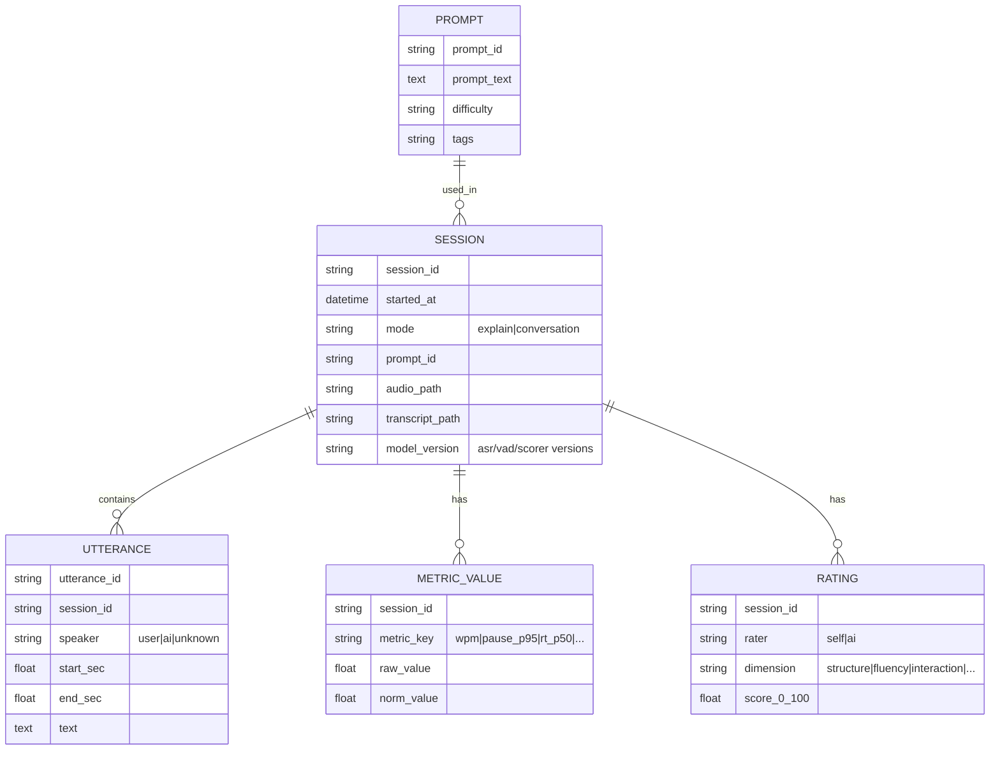

# 説明力・会話力の評価方法とローカル実装前提のAI会話トレーニングアプリ設計知見

- 作成日: 2026-04-11 16:30 JST
- 作成者: Codex (GPT-5)
- 更新日: 2026-04-11

## エグゼクティブサマリ

本調査の結論は、**「音声（話し方）」「文字起こし（内容）」「会話（相互作用と応答速度）」「メタ認知（自己評価との差）」を分離して測り、最後に統合スコアへ正規化して合成する**設計が、説明力・会話力の“伸び”を最も再現性高く捉えやすい、という点にあります。言語評価の実務では、話し方（Delivery）・言語使用（Language use）・話題展開（Topic development）のように観点分解して採点する枠組みが一般的であり（例：TOEFLスピーキングrubric）、この考え方を個人向けアプリへ落とすのが妥当です。citeturn15search0turn15search2turn15search1

会話力・応答速度については、会話分析・心理言語学の知見として「ターン間の沈黙を最小化し、重なりを避ける」傾向が広く報告されており、ターンの“間（ギャップ）”“重なり（オーバーラップ）”“ポーズ”を分布として計測する研究が存在します。したがって、アプリ要件としては **「相手発話の終了時刻」と「自分の発話開始時刻」を高精度に確定できること（=VADとタイムスタンプの品質）**が最重要になります。citeturn11search0turn11search5turn10view1

ローカル実装の観点では、(1)録音、(2)VAD、(3)ASR（文字起こし）、(4)音響特徴抽出、(5)テキスト特徴抽出、(6)ルーブリック採点（必要ならローカルLLM）、(7)履歴DBとダッシュボード、のパイプラインに分けると実装しやすいです。ASRはオープンソースのWhisper系（Whisper本体・whisper.cpp・faster-whisper）がローカル前提と相性が良く、特徴抽出はopenSMILE／Praat系／librosaが「ミニマム構成→拡張」へ段階的に積み上げやすい選択肢です。citeturn0search6turn0search14turn3search0turn3search1turn0search3turn9search0turn9search2

既存の主要アプリは、フィラーワード・話速・間・言い回しなどの「デリバリ評価」中心が多く、会話のターンテイキング（応答遅延や割り込み、相互作用の質）や、自己認識差分（自己評価とAI評価のずれ）を定量指標として前面に出すものは限定的です。したがって自作アプリでは、**自己認識差分の可視化**と**セッション比較（ベースライン対比・前年差分）**をコア価値として設計するのが差別化に直結します。citeturn7search3turn4search2turn8search2

継続利用のUXは、行動変容モデル（行動=動機×能力×プロンプト）や自己決定理論（自律性・有能感・関係性）と整合するように、「短時間で終わる練習」「即時フィードバック」「小さな達成の積み上げ」「負担の少ないリマインド」「比較は“過去の自分”が基本」を中核に置くのが安全で、学習効果の観点では“間隔反復（spaced repetition）”の効果も広く支持されています。citeturn13search0turn1search3turn13search2

## 評価観点一覧

以下は、**音声録音とAI採点（自動計測）を前提**に、説明力・会話力を「観点→指標→測定方法→推奨アルゴリズム/ライブラリ（ローカル向け）」へ分解した一覧です。指標は、既存の言語評価rubric（流暢さ・一貫性・発音・話題展開など）を“機械計測可能な形”に落とす方針で整理しています。citeturn15search0turn15search1turn15search2

| 大分類 | 指標（例） | 定義（何を良いとするか） | 測定方法（ローカル実装の考え方） | 推奨アルゴリズム / ライブラリ（ローカル向け） |
|---|---|---|---|---|
| 音声：流暢さ | 話速（WPM/秒） | 速すぎず遅すぎないテンポで、理解可能な速度で話せる | ASRの単語/形態素数 ÷ 発話時間（VADで“発話区間”を確定） | Whisper系でタイムスタンプ付き文字起こし + VAD（Silero / WebRTC）citeturn0search6turn3search1turn2search1turn2search0 |
| 音声：間・沈黙 | ポーズ率、長ポーズ回数 | 不自然な沈黙や詰まりを減らし、必要な間は効果的に使う | VADで無音区間を抽出し、しきい値（例：≥300ms/≥700ms）別に集計 | Silero VAD / WebRTC VAD、openSMILEでもリアルタイム抽出可能citeturn2search1turn2search0turn0search15 |
| 音声：非流暢性 | フィラー頻度、言い直し | 「えーと/あの/その…」等のフィラーや言い直しを抑える | 文字起こし上のフィラー辞書検出＋（可能なら）音響ベース検出 | フィラー検出研究例（データセット/ベンチマーク）を参照し、まずは辞書→拡張で音響モデルへciteturn11search19turn11search3 |
| 音声：抑揚・表現 | ピッチ変動、強弱、単調さ | 単調でなく、要点で抑揚や強調がある | F0（基本周波数）・強度の分散/レンジを算出 | Praat / Parselmouth、openSMILE（F0, loudness等）citeturn9search0turn9search13turn0search19 |
| 音声：明瞭性（代理） | ASR信頼度/編集距離（課題が台本読みの場合） | 聞き取りやすく破綻しない（※自動計測は“代理指標”） | 「台本あり課題」では参照テキストとの距離、自由発話ではASRの信頼度や再認識率など | Whisper系（ログ確率等）＋参照比較（BERTScore等は内容寄り）citeturn0search6turn1search2 |
| テキスト：構造 | イントロ→要点→まとめ | 導入・本論・結論があり、道筋が明示される | 見出し語/談話標識の検出（例：まず/次に/結論）＋段落推定 | RSTの考え方を参照しつつ、MVPは談話標識+ルーブリックで近似citeturn1search4 |
| テキスト：一貫性 | 局所一貫性（文つながり） | 文間のつながりが自然で、話題が飛ばない | 名詞（エンティティ）遷移や参照の連続性で近似 | entity-grid（局所一貫性評価）を参考に、まずは名詞遷移の簡易版citeturn10view2 |
| テキスト：語彙の豊かさ | 語彙多様性（MTLD等） | 同語反復を避け、必要十分な語彙で説明できる | 形態素分割したトークン列でMTLD等を算出 | 日本語形態素：SudachiPy/MeCab、語彙多様性：MTLD系指標citeturn3search2turn3search3turn1search1 |
| テキスト：要点充足 | キーポイント被覆率 | 説明で必須要点が抜けない | 参照要点（ユーザー定義）と発話の意味類似度を測る | sentence-transformers等の埋め込み類似、BERTScoreも候補citeturn14search2turn1search2 |
| 会話：応答速度 | 応答遅延（RT） | 相手ターン終了から自分の開始までが適切（短すぎ/長すぎを避ける） | 「相手音声終了」→「自分VAD開始」差分、分位点で評価 | ターンテイキング研究の測り方（ギャップ/オーバーラップ分布）を踏襲citeturn10view1turn11search0 |
| 会話：割り込み/重なり | オーバーラップ率 | 相手の話を不必要に遮らない | 2話者の発話区間の重なり率（ただしローカルで話者分離が必要） | pyannote.audio等で“誰がいつ話したか”推定（MVPはAI相手なら分離不要）citeturn2search2 |
| 会話：相互作用 | 質問率、相づち、確認 | 相手理解を促し、双方向性がある | 文字起こしから疑問表現・確認表現・要約表現をタグ付け | ルール+形態素+（可能なら）ローカルLLMで発話行為分類citeturn15search2turn14search0 |
| メタ認知 | 自己認識差分 | 自己評価とAI評価のズレを縮める | セッション毎に自己スコア入力→AIスコアとの差分をトラッキング | DBに自己評価を保存し、差分・偏り指標を算出（後述）citeturn12search2 |

補足として、会話のタイミングには文化差の議論がありつつも「沈黙最小化・重なり回避」の傾向が多言語で観測された報告があり、また応答の速さが社会的つながりの知覚に影響するという実験結果もあるため、**応答遅延は“速ければ良い”ではなく、状況別の目標レンジを置いて制御する**設計が現実的です。citeturn11search0turn11search10turn11search2

## スコアリング方法

ここでは「スコアの正規化」「重み付け」「自己認識差分（メタ認知）」「履歴比較」を、ローカル実装で扱いやすい数式と手順で提示します。言語評価rubricが示すように、単一の総合点よりも**次元別スコア**（Delivery/Fluency/Coherence/Interaction等）を残す方が学習に直結しやすいため、総合点は“要約用”に位置づけます。citeturn15search0turn15search2

### 指標の正規化（0〜1）

指標 \(x_i\) を 0〜1 に写像してから合成します。ローカル運用で現実的なのは次の3系統です（併用可）。

**A. 目標値（ターゲット）中心のベル型スコア（話速などに向く）**  
話速のように「適正帯」がある場合、中心 \(t_i\)、許容幅 \(\sigma_i\) を置いて

\[
n_i=\exp\left(-\left(\frac{x_i-t_i}{\sigma_i}\right)^2\right)
\]

とすると、極端に速い/遅いを自然に減点できます（0〜1）。「応答遅延」も“短すぎる割り込み”と“遅すぎる沈黙”の両方を嫌うなら同型が使えます。ターン間ギャップやオーバーラップを分布として扱う研究の考え方とも整合します。citeturn10view1turn11search0

**B. 範囲（下限/上限）でのmin-max（回数・率などに向く）**  
“多いほど良い”指標は

\[
n_i=\mathrm{clip}\left(\frac{x_i-l_i}{u_i-l_i},0,1\right)
\]

“少ないほど良い（フィラー率・長ポーズ率など）”は

\[
n_i=1-\mathrm{clip}\left(\frac{x_i-l_i}{u_i-l_i},0,1\right)
\]

で統一できます。しきい値 \(l_i,u_i\) は「一般目安」よりも、**自分の過去データの分位点**（例：直近20セッションの5%点と95%点）で更新すると、個人差を吸収できます。citeturn10view1turn12search2

**C. 個人ベースライン（ロバストZ）→シグモイド（履歴比較に強い）**  
履歴比較を前提にするなら、ベースライン（最初のN回）から中央値とIQRを持ち

\[
z_i=\frac{x_i-\mathrm{median}_i}{\mathrm{IQR}_i+\epsilon}, \quad n_i=\sigma(k z_i)=\frac{1}{1+e^{-k z_i}}
\]

が扱いやすいです（外れ値に強い）。ここで“少ないほど良い”指標は \(z_i\) に符号反転を入れます。citeturn12search2

### 次元別スコアと総合点（重み付け例）

指標をグルーピングして、次元 \(d\) ごとに

\[
S_d = 100 \cdot \frac{\sum_{i \in d} w_i n_i}{\sum_{i \in d} w_i}
\]

総合点は

\[
S_{\mathrm{all}} = 100 \cdot \frac{\sum_d W_d \cdot (S_d/100)}{\sum_d W_d}
\]

とします。

**重み付け例（用途別）**  
- プレゼン/説明中心：構造・要点（0.35）、流暢さ/間（0.25）、抑揚/明瞭性（0.20）、簡潔さ（0.10）、メタ認知（0.10）  
- 会話中心：応答速度/ターン（0.30）、相互作用（0.25）、流暢さ/間（0.20）、内容の一貫性（0.15）、メタ認知（0.10）

既存rubricが示す「Delivery/Topic development/Fluency/Interaction」と対応させると説明しやすく、ユーザー自身も納得しやすい構成になります。citeturn15search0turn15search1turn15search2

### 自己認識差分（自己評価 vs AI評価）の指標化

セッション \(t\)、次元 \(d\) について、自己評価 \(H_{t,d}\)（Human self）とAI評価 \(A_{t,d}\) を 0〜100で持ちます。

- **差分（バイアス）**：\(\Delta_{t,d}=A_{t,d}-H_{t,d}\)（プラス=過小評価、マイナス=過大評価）
- **較正誤差（キャリブレーション誤差）**：\(E_{t,d}=|\Delta_{t,d}|\)
- **長期の自己認識ズレ**：\(\overline{\Delta_d}=\mathrm{mean}_t(\Delta_{t,d})\)  
- **見積もり精度の改善**：\(\mathrm{trend}(E_{t,d})\)（回帰直線の傾き）

UXでは、\(\Delta\) をそのまま見せるより、**「過大評価傾向」「過小評価傾向」**として意味づけし、改善目標を“技術”と“自己把握”で分けると、継続の納得感が出ます（自己決定理論の“有能感”を毀損しにくい）。citeturn1search3turn12search2

### 測定の信頼性（ぶれ）を抑える設計要点

同じ人でも日によって話速や間は変動するため、スコアの信頼性を高めるには「課題の固定」「分布で見る」「短期ブレと長期トレンドの分離」が重要です。会話の間・ギャップが分布として議論されることは、この設計に直接合致します。citeturn10view1turn11search0

- 課題は「自由発話」だけでなく「固定プロンプト（同一条件）」を最低1本含める  
- 単発の平均ではなく、分位点（P50/P80/P95）で“悪い癖”を捉える（例：長ポーズのP95）  
- 総合点よりも次元別スコアのトレンドを主画面に置く（rubric整合）citeturn15search0turn10view1

## 既存アプリ比較

以下の表は、主要アプリ/サービスについて、**公式サイト・公式料金ページ・公式プライバシー記載・公式ストア記載**に基づき「機能」「評価指標」「プライバシー/ローカル実行可否」「料金モデル」を整理したものです。ローカル実行可否について、公式に明示がない場合は「未指定」としています（=推測しない）。citeturn5search0turn7search14turn7search3turn17search2turn6search14turn5search6turn5search3turn6search4turn16search0turn6search2

| アプリ/サービス | 主用途 | 評価指標（公式に言及がある範囲） | プライバシー/ローカル実行可否（公式記載ベース） | 料金モデル（公式記載ベース） |
|---|---|---|---|---|
| entity["company","Yoodli","ai speech coaching platform"] | スピーチ/面接/ロールプレイの解析 | フィラー、話速、アイコンタクト等の分析（例示あり） | 共有可視性（Private/Public等）設定、プライバシー/認証等の言及あり。ローカル実行は未指定 | 無料枠あり、個人/企業プランあり |
| entity["company","Poised","ai communication coach"] | オンライン会議のリアルタイム支援 | 簡潔さ、ヘッジ語、割り込み、フィラー等（料金ページで明示）、ベンチマーク/トレンド | “プライベート”“録音制御”“セキュリティ”の言及あり。ローカル実行は未指定 | Freeあり、Proは月額課金等 |
| entity["company","Orai","ai public speaking app"] | プレゼン練習と即時フィードバック | フィラー、ペース、簡潔さ、明瞭性、進捗トラッキング等 | GDPR対応等の記載あり。ローカル実行は未指定 | ストア上はアプリ内課金（詳細プランはストア表示） |
| entity["company","Speeko","ai public speaking app"] | スピーチコーチング | ペース、トーン、フィラー、抑揚、（サイト上）感情/センチメント等 | 録音は本人のみアクセス可能等の主張あり。ローカル実行は未指定 | サブスク（ストア上） |
| entity["company","VirtualSpeech","vr soft skills training"] | VR/オンラインでのソフトスキル訓練 | AIアバターroleplay、AIフィードバック、AIコーチ等 | プライバシー/AIとデータに関する説明ページあり。ローカル実行は未指定 | 公式の料金ページでプラン提示 |
| entity["company","ELSA Speak","ai english speaking coach"] | 英語発音・英会話練習 | AI role-play、進捗トラッキング、トランスクリプト/語彙提案等 | プライバシー通知あり。ローカル実行は未指定 | Free/Premiumの区分あり（価格詳細はページ/ストアで変動） |
| entity["company","Speak","ai language learning app"] | AI会話での語学学習 | “話して即時フィードバック”を主訴求 | ローカル実行は未指定 | 料金は未指定（公式ページ上で一般価格の明示は限定的） |
| entity["company","Duolingo","language learning company"] | 語学学習（スピーキング練習含む） | 繰り返し発話・対話形式などのスピーキング練習 | ローカル実行は未指定 | 料金モデルは未指定（プラン体系は地域・時点で変動） |
| entity["company","Ummo","speech coach app"] | スピーチの癖計測（旧来） | フィラー、話速、明瞭性、ポーズ等（紹介記事ベース） | 公式サイトの健全性が未確認（現状、公式一次情報が取りづらい）。ローカル実行は未指定 | 未指定 |
| entity["company","Oompf","ai speech coach app"] | 会話/面接/プレゼン練習 | “実状況の練習+即時フィードバック”を訴求 | ローカル実行は未指定 | ストア上は無料+アプリ内課金 |

**表の根拠（代表）**：entity["company","Yoodli","ai speech coaching platform"]の料金・サブスク・プライバシー/共有設定に関する記載、entity["company","Poised","ai communication coach"]の料金ページ（フィラー・割り込み等）とプライバシー/セキュリティ、entity["company","Orai","ai public speaking app"]の公式サイト/ストア記載、entity["company","Speeko","ai public speaking app"]の公式サイト/プライバシー、entity["company","VirtualSpeech","vr soft skills training"]の公式サイト/料金/プライバシー/AIとデータ、entity["company","ELSA Speak","ai english speaking coach"]の機能比較/プライバシー、語学系としてentity["company","Speak","ai language learning app"]とentity["company","Duolingo","language learning company"]のスピーキング練習に関する公式説明、entity["company","Oompf","ai speech coach app"]のストア記載、entity["company","Ummo","speech coach app"]は一次情報が乏しいため紹介記事のみ。citeturn5search0turn5search8turn17search3turn17search23turn7search14turn8search2turn16search6turn7search3turn7search7turn17search1turn17search2turn17search10turn6search14turn6search1turn16search1turn16search5turn5search6turn17search0turn5search3turn6search4turn16search0turn6search2

## 自作アプリに必要な機能

ここでは「個人利用のローカルアプリとして実装しやすい」ことを優先し、音声録音とAI採点を核にした要件を、**パイプライン要件（処理）**と**プロダクト要件（体験）**に分けて定義します。ローカル実装の実務上、ASR/VAD/特徴抽出/DBを疎結合にすると、評価指標の追加が容易になります。citeturn0search6turn3search0turn2search1turn12search2

### 最小パイプライン要件（ローカルで完結する処理）

**録音**  
- マイク入力をWAV等で保存（サンプリング周波数は16kHz/monoへ正規化が扱いやすい＝VAD/ASRの前提を揃える）。未指定。

**VAD（Voice Activity Detection）**  
- 無音・発話区間を抽出し、「話速」「ポーズ」「応答遅延」の時間計測の基礎とする。  
- 実装候補：Silero VAD（軽量・高速を主張）／WebRTC VADのPythonラッパ。citeturn2search1turn2search0

**ASR（文字起こし）**  
- ローカル完結ならWhisper系が選択肢になりやすい（多言語・長尺に強いという評価）。  
- 実装候補：Whisper（参照実装）、whisper.cpp（C/C++移植で多環境対応）、faster-whisper（CTranslate2で高速化を主張）。citeturn0search6turn0search14turn3search0turn3search1

**単語/音素レベルのタイムアラインメント（任意だが精度向上）**  
- 目的：ポーズ位置、フィラー位置、話速の精度、応答遅延を“単語境界”で扱う。  
- 実装候補：Montreal Forced Aligner（Kaldiベース）。ただし準備コストが上がるためMVPでは後回しでもよい。citeturn2search3turn2search7turn2search11

**音響特徴抽出**  
- openSMILE：大量特徴を一括抽出でき、リアルタイム入力も想定された記述がある。citeturn0search19turn0search15  
- Praat/Parselmouth：F0やフォルマント等、音声学寄りの指標に強い。citeturn9search0turn9search13  
- librosa：Pythonでの一般的な音声解析基盤。citeturn9search2turn9search6

**テキスト特徴抽出（日本語）**  
- 形態素：SudachiPyやMeCabで分割し、語彙多様性やフィラー辞書検出を安定化。citeturn3search2turn3search3  
- 構文/係り受け：GiNZA（spaCyベース）で文構造特徴（平均係り受け距離等）を追加可能。citeturn14search3

**ルーブリック評価（定性的スコア）**  
- 自動計測だけでは「構造の良さ」「話題展開の自然さ」を取り切れないため、TOEFL/IELTS/CEFRの観点に合わせた“採点コメント生成”を、(a)ルール+統計、または(b)ローカルLLMで実装する。citeturn15search0turn15search1turn15search2  
- ローカルLLM候補：llama.cpp（GGUF量子化モデルをローカル推論する枠組み）。citeturn14search0turn14search1

**データ保存（履歴比較の前提）**  
- セッション・発話・指標・自己評価・AI評価を、SQLite等のローカルDBへ保存し、常に差分比較できるようにする。citeturn12search2turn12search5

### 会話トレーニング体験要件（UXと継続設計）

**セッション設計（会話能力と説明能力を分けて鍛える）**  
- 説明セッション：固定プロンプト（例：手順説明、要約、比較説明）＋自由プロンプト。構造・要点・簡潔さを主評価。未指定。  
- 会話セッション：ロールプレイ（面接・雑談・報連相・難しい会話）で、応答遅延・割り込み・相互作用を主評価。既存サービスではロールプレイ/roleplay訴求が多い。citeturn8search7turn5search6turn5search0

**フィードバック頻度（継続に効く具体実装）**  
- セッション直後：次元別スコア（例：話速/間/構造/応答）と、最重要改善点“1つ”を即時提示（認知負荷を下げる）。  
- 週次：トレンド（平均との差分、P95の改善など）と、次週の“おすすめ課題”を提示（Poisedがベンチマーク/トレンド/チャレンジを訴求）。citeturn8search2turn7search14  
- 間隔反復：前回つまずいた観点を、数日後に再提示（spaced repetitionの効果が支持される）。citeturn13search2turn13search5

**通知（リマインド）**  
- 行動モデル（動機×能力×プロンプト）に合わせて、通知は“短くできる行動”に紐づける（例：「90秒だけ、要点→結論の練習」）。citeturn13search0  
- 自己決定理論に配慮し、通知は頻度・時間帯・OFFをユーザーが制御できる（自律性を担保）。citeturn1search3

**ゲーミフィケーション（過剰に競わせない）**  
- “連続記録（streak）”より、**「週あたり練習回数」×「改善率」×「自己認識差分の縮小」**の複合で“成長”を見せた方が、説明力・会話力の目的に整合します（自己比較が基本）。理論背景としては自己決定理論が参照されることが多い。citeturn1search3turn13search3

### セッション比較ダッシュボード設計

ダッシュボードは「1回の出来」の評価よりも、「**どこが、どの程度、どんな分布で改善したか**」と「**自己認識差分が縮んでいるか**」を中心に置きます。会話の間・ギャップが分布として扱われる研究知見に合わせ、平均だけでなく分位点を標準表示にします。citeturn10view1turn11search0

**ワイヤーフレーム（簡易）**

```
┌──────────────────────────────────────────────┐
│ セッション比較（最新 vs ベースライン / 直近平均との差分） │
├──────────────────────────────────────────────┤
│ [総合点]  72 → 78 (+6)     [自己認識差分]  |Δ| 15 → 9 (-6) │
│  次元別:  構造 70→80  間 60→68  応答 75→76  抑揚 65→66     │
├──────────────────────────────────────────────┤
│ 話速・間（分布）                               │
│  - 話速WPM:  P50=145  P95=190  (目標帯 120-170) │
│  - ポーズ:   700ms超回数  8→3                   │
│  - 応答遅延: P50=320ms P95=1200ms               │
├──────────────────────────────────────────────┤
│ 内容（構造/要点）                              │
│  - 要点被覆率: 0.62→0.74                        │
│  - 構造スコア(導入/道筋/結論): 2.5→3.6/5         │
│  - 冗長性: 0.30→0.22                             │
├──────────────────────────────────────────────┤
│ 自己評価 vs AI評価（次元別）                    │
│  構造: 自己85 / AI80  (過大評価 -5)              │
│  応答: 自己60 / AI76  (過小評価 +16)             │
└──────────────────────────────────────────────┘
```

**データモデル（ER図例：SQLite想定）**  
（セッション単位の比較と、自己評価・AI評価・指標を正規化して保存する）



ダッシュボード実装は、ローカルWeb（例：Dash等）で十分で、SQLiteから読み出す構成が扱いやすいです。citeturn12search6turn12search18turn12search2

## MVPと拡張機能の切り分け

ローカル実装の現実的な難所は「話者分離（誰がいつ話したか）」「高精度アラインメント」「高度な意味評価（要点抽出・正確性確認）」です。したがってMVPでは、**AI相手の会話を“別チャンネル管理（AI音声をアプリ側で生成・再生し時刻を既知化）”**して、話者分離を回避するのが堅実です（応答遅延計測が一気に簡単になります）。会話のギャップ/オーバーラップを正しく測る研究があること自体が、ここを“計測の土台”として優先すべき根拠になります。citeturn10view1turn2search2

| 区分 | 機能 | ねらい | 実装難易度（ローカル） | 代表技術/ライブラリ候補 |
|---|---|---|---|---|
| MVP | 録音→VAD→ASR→話速/ポーズ/フィラーの自動採点 | 最低限の定量化で“現状把握” | 低〜中 | Silero/WebRTC VAD、Whisper系citeturn2search1turn0search6turn3search1 |
| MVP | セッション保存（SQLite）＋履歴比較（トレンド/前年差分） | 継続するほど価値が増える核 | 中 | SQLiteciteturn12search2 |
| MVP | 自己評価入力（次元別）＋自己認識差分の可視化 | 自己把握を改善対象にする | 中 | ER図のRATINGを実装（ロジックは単純）citeturn12search2 |
| MVP | 固定プロンプト（説明）＋自由練習 | 信頼性（ぶれ）を下げる | 低 | プロンプトテーブル管理（PROMPT） |
| 拡張 | 音響特徴の拡張（ピッチ/強度/単調さ等） | 表現力・説得力の定量化 | 中 | openSMILE、Praat/Parselmouthciteturn0search19turn9search13 |
| 拡張 | 高精度アラインメント（単語/音素） | ポーズ・フィラー位置の精度向上 | 中〜高 | Montreal Forced Alignerciteturn2search3turn2search7 |
| 拡張 | 話者分離（2話者以上の自然会話） | 割り込み/会話バランス評価 | 高 | pyannote.audio（モデル配布/取得の運用注意）citeturn2search2 |
| 拡張 | 内容評価の高度化（要点抽出・一貫性・ルーブリックコメント） | “説明の中身”を伸ばす | 中〜高 | entity-grid思想、RST思想、埋め込み類似、ローカルLLMciteturn10view2turn1search4turn14search2turn14search0 |
| 拡張 | AI相手の音声生成（ローカルTTS） | 会話練習を完全ローカル化 | 中 | Piper / Coqui TTSciteturn12search0turn12search1 |

未指定：OS/言語（日本語/英語）ごとのモデル選定、GPU有無、ユーザーがどの領域（雑談/面接/プレゼン/業務説明）を最優先にしたいかによって、最適なMVP構成は変動します。

## 参考情報源カテゴリ

本レポートで利用した（または設計の根拠として参照した）一次情報のカテゴリを、アプリ設計に直結する形で整理します。

学術論文・学術的知見としては、会話のターンテイキング（ギャップ/オーバーラップ、応答遅延の分布）や、局所一貫性（entity-grid）・談話構造（RST）・語彙多様性（MTLD）など、**“説明/会話の質”を分解して操作可能にする枠組み**が特に重要でした。citeturn10view1turn11search0turn10view2turn1search4turn1search1

公式ドキュメントとしては、ASR/VAD/特徴抽出の“ローカル実装で再現可能な部品”を確認するために、Whisper系・VAD・openSMILE・Praat・librosa・MFA・日本語NLP・ローカルLLM推論枠組みの公式情報を重視しました。citeturn0search14turn3search0turn2search1turn0search3turn9search0turn9search2turn2search3turn3search2turn14search0

主要アプリ公式サイトとしては、既存プロダクトが“何を指標として売りにしているか”と“プライバシー・進捗トラッキングの扱い”を把握するために、公式料金・機能・プライバシーの記述を根拠として参照しました（未指定は未指定）。citeturn5search0turn7search14turn7search3turn17search2turn6search14turn5search6turn6search4turn17search3turn16search6

行動変容/継続利用（UX）については、行動モデル（動機・能力・プロンプト）と自己決定理論、および学習効果としての間隔反復に関する文献を、通知・目標設計・フィードバック頻度設計の理論的支柱として扱いました。citeturn13search0turn1search3turn13search2
