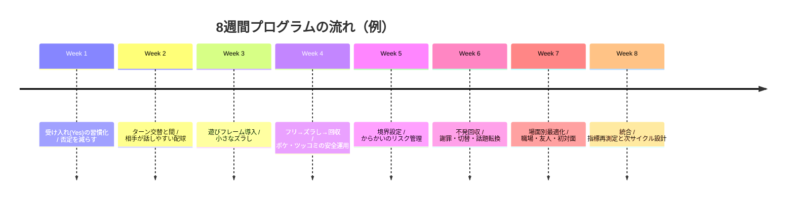
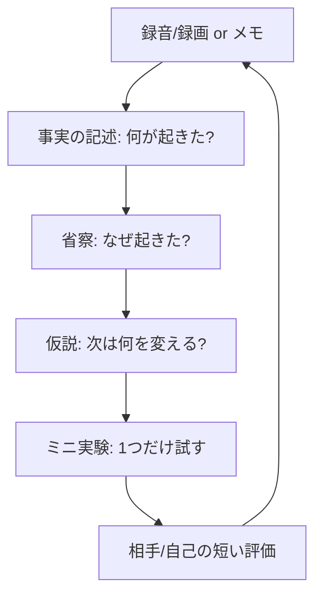

# ユーモアのある楽しい会話のためのトレーニング方法  
（分析・実践レポート／2026-04-11 JST）

- 作成日: 2026-04-11 16:30 JST
- 作成者: Codex (GPT-5)
- 更新日: 2026-04-11

## エグゼクティブサマリー

本レポートは、**「笑わせる話術」よりも先に、相手と自分が“安心して遊べる会話”を共同で作る能力**を中心に設計した。理由は、笑いはジョーク反応に限定されず、会話内での**同意・親和・理解表示**として機能し、社会的に伝播しうる行動だからである。さらに、集団での笑いが痛覚閾値（エンドルフィン活性の代理指標）を高める実験的所見や、社会的笑いがオピオイド系を介して社会的結束に関与しうる神経科学的所見が報告されている。citeturn35view0turn37view0turn19view2

理論枠組みは、(1) **ユーモア心理学**（不一致・緊張解放などの古典理論／「逸脱が無害に知覚されるときに面白さが生じる」という良性逸脱の観点）、(2) **会話分析**（順番交替、笑いの「起こりどころ＝位置」の組織化、からかいの成立条件）、(3) **即興（インプロ）の原理**（Yes, And、失敗許容、心理的安全性）を統合した。citeturn24view2turn24view0turn19view3turn33view0turn20view1turn23view5turn39view0turn19view4

実践面では、学習を「**短い反復×振り返り**」で回す。根拠は、技能熟達研究が示す意図的練習（目的・負荷・フィードバックを伴う反復）と、経験学習理論が示す「経験→省察→概念化→実験」の循環が、対人スキル訓練にも適用しやすいからだ。citeturn20view5turn19view5  
なお、あなたの**目的（職場／友人／初対面など）・年齢層・文化圏・許容されるノリの強度・確保できる練習時間**は未指定のため、本レポートでは代表的な場面別に「安全側」から設計し、カスタマイズ可能な形で提示する（未指定）。

成果指標は、**「面白さ」単独ではなく**、①相手の安全感、②会話の往復（ターン交替の滑らかさ）、③“遊びフレーム”の共同成立、④不発時のリカバリー、⑤職場なら関係悪化リスク低減を優先する。職場ユーモアはタイプにより心身健康・業務自己評価への影響が異なるため、特に職場では「規範抵触型」などに注意し、「体験共有的」等の方向へ寄せる設計が合理的である。citeturn9view3turn23view3

## 目的と期待される効果

ユーモア会話トレーニングの第一目的は、**相手と自分の間に「軽い遊び（playfulness）」を安全に立ち上げ、会話を前へ進める協同作業の精度を上げること**である。冗談・からかい・疑似インポライトネスがうまく機能するには、「これは遊びである」という相互理解（フレーム）の構築が重要で、言語・非言語の複合的手段で支えられる。citeturn20view2turn23view5

期待効果は、(a) **親和・連帯感（ラポール）の増加**、(b) **相互理解の表示が上手くなる（うなずき・相槌だけでなく“笑い”も含む）**、(c) **場の緊張を下げる**、(d) **創造的なやりとり（発想の展開・合意形成）の促進**である。笑いは会話内で親和・合意・理解などを示す機能を持ち、笑いは「面白い」だけでなく社会的に伝播する側面が指摘されている。citeturn35view0turn37view0

健康面・メンタル面については、笑いを誘発する介入（例：笑いヨガやユーモア介入等）に関する系統的レビュー／メタ分析が存在し、幅広い症例・対象で精神的・身体的健康アウトカムを扱っているが、研究の質やバイアス等を含めて慎重な解釈が必要とされる。citeturn23view1turn23view2（この領域は「会話スキル訓練」の直接証拠とは別系統なので、ここでは“副次的可能性”として扱う。）

職場効果については、ポジティブな職場ユーモアに関するメタ分析があり、仕事満足・パフォーマンス・結束・健康などとの正の関連や、バーンアウト・ストレス・離脱との負の関連が要約される一方、育成時には法的・倫理的懸念（侮辱的・性差別的など）への注意が明示されている。citeturn42view0

## 理論的背景

ユーモア心理学の整理としては、古典的には「不一致（期待外れ）」「緊張解放」など複数の理論があり、単一理論で全てのユーモア事例を説明することの難しさも指摘される。citeturn24view2turn24view0  
この“多理論性”は実務的には利点で、トレーニング設計では「どの理屈で笑いが起きやすいか」を固定せず、**会話内で安全に試行錯誤できる構造**を用意する方が再現性が高い。

リスク管理に直結する理論として、良性逸脱（Benign Violation）の枠組みは「逸脱（violation）が、同時に無害（benign）に知覚されるとき、面白さが生じうる」と統合的に説明し、無害化条件（別規範の存在、規範へのコミットの弱さ、心理的距離など）を実験的に扱っている。citeturn19view3  
会話訓練では、この理論を「**面白さを作る道具**」というより「**不快感を避ける安全装置**」として使うのが実践的である（後述）。

会話分析（Conversation Analysis）は、会話が「順番交替」によって組織され、ターンには完結点（移行適切箇所）があり、話者交替がそこを参照して最小化された間（gap）や重なり（overlap）で運用される、といった観点を提供する。citeturn23view7turn33view0  
ユーモア会話は、この順番交替の上で「笑う位置」を共同で作る。落語会の観客の笑いを会話分析した研究では、「ボケ＋ツッコミ」の構造が“笑う位置”の探索の枠組みになり、参加者がその位置で笑うことを協同達成する様子が記述されている。citeturn20view1

さらに、からかい・冗談・疑似インポライトネスでは「遊びフレーム」の共有が不可欠で、フレームはマルチモーダル（言語・視線・表情・タイミング等）に構築される。citeturn20view2turn23view5  
職場会議でも、からかいが活動移行時などの特定位置で現れ、雰囲気調整や連帯感と結びつくといった問題設定がなされている。citeturn23view5turn23view6

即興（インプロ）の原理は、(a) 相手の提示を受け入れ、そこから付け加えて返す **Yes, And**、(b) 失敗を前提に学びへ変える、(c) チーム創作の基盤としての心理的安全性、を重視する。Yes, Andは「肯定的に受け入れ、追加して返す」方法であり、Yes, Butが共創を止めやすい点も指摘される。citeturn39view0  
心理的安全性は、対人リスクを取ることが安全だという共有信念として扱われ、学習行動を支える媒介となりうる。citeturn19view4turn23view3

## トレーニング設計とメニュー

本レポートの実践設計は、(1) 意図的練習（負荷とフィードバックを伴う反復）と、(2) 経験→省察→概念化→実験の循環を核にする。citeturn20view5turn19view5  
また、インプロ系ワークショップ研究では、練習課題（エクササイズ）と振り返り（シェア）を往復し、失敗不安を下げる雰囲気づくりが重要だと整理される。citeturn30view2turn30view0turn29view3

### レベル別トレーニング設計

以下のレベル表は、国内の段階別クラス制度やYes, And系の入門クラス設計例、ならびに会話分析・ユーモア心理学の知見を統合して「初心者でも事故りにくい順」に並べ替えた提案である（最適性が確定した唯一解ではない）。citeturn31view1turn38view0turn39view0turn20view1turn19view3

| レベル | 核となる能力 | 典型的な失敗パターン | 推奨フォーカス（安全側） | 目安の主戦場 |
|---|---|---|---|---|
| 初心者 | 受け入れ（Yes）・相手理解・順番交替 | オチを急ぐ／否定（Yes, But）／一人で頑張る | 「肯定＋小さな付け足し」・相槌＋要約・短い観察ユーモア | 初対面〜職場の軽い雑談 |
| 中級 | 展開（And）・遊びフレーム維持・軽いズラし | からかいが刺さる／内輪化／話が長い | 共同で作る“笑う位置”・短いフリ→ズラし・小さな反復 | 友人／チーム内の雑談 |
| 上級 | 状況適応・不発回収・場の設計（ファシリ） | 強い逸脱で事故／権力差を見誤る | 無害化（benign化）設計・リカバリー台本・心理的安全性の維持 | 会議・場回し・複数人 |
| 熟達 | 即興構成力・複数人の共創・文化差調整 | 誰かが置いていかれる | “全員が参加できる遊び”のデザイン・境界の明示 | グループ／研修／司会 |

### 練習の進行表（1回60分の標準フォーマット）

この「エクササイズ→振り返り→次の試行」の構造は、インプロ指導実践の分析でも中心要素として整理される。citeturn30view0turn30view2

| 時間 | 目的 | 内容（例） | 結果の取り方 |
|---:|---|---|---|
| 0–5分 | 心理的安全性の宣言 | 「今日は“上手さ”ではなく“試す”日」／拒否権の確認 | 参加者の同意（口頭） |
| 5–15分 | 身体と注意の同期 | ミラーリング／名前リレー（躊躇を祝う等） | 緊張度の主観(1–7) |
| 15–30分 | マイクロ技能 | Yes, And 連鎖／要約＋付け足し／ターン交替ドリル | Yes率・被せ回数 |
| 30–45分 | 応用（短い場面） | 2分×3本の即興雑談／役割別ロールプレイ | 相手の反応・不発回収 |
| 45–55分 | 振り返り（シェア） | 何が起きたか→なぜ→次は何を試すか | 3点メモ（後述） |
| 55–60分 | 次回の実験設定 | 次の会話で試す“一言”を決める | 行動コミット |

### 練習頻度・時間配分（提案）

最小構成は「毎日10分の個人練習＋週1回のペア練習」だが、上達速度を上げるなら「短い反復」を週に複数回入れる方が設計しやすい。これは意図的練習の枠組みと、経験学習サイクル（短い経験を回す）に整合する。citeturn20view5turn19view5  
推奨目安（提案）：**週3回（個人2回×15分＋ペア/グループ1回×60分）**。職場ユーモアはタイプによって悪影響もあり得るため、職場適用が主目的なら「無害化・体験共有寄り」を強制制約として入れる。citeturn9view3turn19view3

### 8週間の週間スケジュール（例）

以下は「未指定の条件」を前提にした標準案で、目的が職場中心・友人中心・初対面中心で配分を変える（後述）。citeturn39view0turn30view2turn33view0

| 週 | 週の狙い | 個人（15分×2） | ペア/グループ（60分×1） | 実戦課題（生活内） |
|---|---|---|---|---|
| 1 | 安全な“受け入れ” | 要約＋一言追加／観察メモ | Yes, And基礎＋振り返り | 否定から入らない返答を3回 |
| 2 | ターン交替の整流 | 間（沈黙）耐性／相槌の種類 | 交替ルールドリル＋短雑談 | 相手に質問→返答を促す×3 |
| 3 | 遊びフレーム導入 | 軽い比喩／言い換え | “ズラし”最小単位＋回収 | 小さな言い間違いを笑って回収 |
| 4 | ボケ/ツッコミの安全運用 | フリ→ズラし1回 | 台本ロールプレイ（後述） | 反復（笑いの再提示）を1回 |
| 5 | からかいの境界 | 禁止領域マップ作成 | からかい→同意確認→撤退 | 「そのノリOK？」確認を1回 |
| 6 | 不発回収 | 謝罪＋切替フレーズ練習 | 不発シナリオ集で訓練 | 不発を2ターンで畳む |
| 7 | 場面別チューニング | 職場/友人/初対面を選択 | 目的場面の模擬会話 | 実戦で1テーマ試す |
| 8 | 統合と再設計 | 指標の再測定／棚卸し | 発表（短い雑談デモ）＋評価 | 自分用の練習メニュー確定 |


citeturn39view0turn30view2turn33view0turn19view3

## 例題：会話例・ロールプレイ台本・即興ドリル

ここでは「攻めた冗談作り」より、**相手が参加できる“軽い楽しさ”を増やす**ための例を提示する。笑いはジョーク反応に限定されず、コメントや同意・理解表示として機能するため、まずは“笑わせる”より“笑いが起きてもよい空気”の設計を練習対象にする。citeturn35view0turn20view2

### 練習用会話例

**会話例（職場・安全側：体験共有＋軽いズラし）**  
（狙い：職場で悪影響になりやすい「規範抵触型」を避け、共有と相互コミュニケーションを増やす）citeturn9view3turn23view3

```text
A: おはようございます。今日ちょっと寒いですね。
B: ですね。通勤で「冬が本気出してきた」って思いました。
A: わかります。私、手袋が行方不明で…毎年この時期に“消える先輩”が出ます。
B: ありますね（笑）。私は逆に、手袋を買い直すと翌日に出てきます。
A: じゃあ今日、買いに行ってみてください。みんなの手袋が戻るかもしれない。
B: 世界平和のために買います。
```

**会話例（初対面：自己開示を小さく、観察ユーモア）**  
（狙い：距離がまだ短いので、逸脱を弱く・無害化を強く）citeturn19view3turn20view2

```text
A: はじめまして。今日は来る途中、道に迷いませんでした？
B: 実は少し…。
A: 仲間です。私は「ここはどこ？」って顔で歩くのが得意で。
B: （笑）私もです。Googleマップに頼りすぎてます。
A: わかります。地図って、たまに急に“試験”出してきますよね。
B: 出してきます。今日の問題、結構むずかしかったです。
```

**会話例（友人：軽いからかい→同意確認→回収）**  
（狙い：からかいは共同作業であり、遊びフレームの合意が必要）citeturn23view5turn20view2

```text
A: また新しい水筒？何本目だよ。
B: これは“最終形態”だから。
A: その言い方、だいたい最終じゃないんだよね（笑）。このノリ大丈夫？
B: 大丈夫。むしろ言ってほしい。
A: 了解。じゃあ次は“最終形態（改）”が出ても驚かない。
B: 先回りツッコミやめて（笑）。
```

### ロールプレイ台本（15分×2本）

**台本1：不発回収（2ターンで畳む）**  
（根拠：笑いは社会的で、常に「面白いこと」だけで成立しない。失敗を学習に変える設計が重要）citeturn35view0turn29view3turn30view2  

- 役割：話者A（試す人）、話者B（反応する人）、観察者C（記録）  
- シーン：休憩室での雑談開始30秒  
- ルール：Aは必ず1回“小さなズラし”を入れる。Bは「笑う/流す/困る」のどれでもよい。Aは2ターン以内に回収する。

```text
A: 今日はコーヒーが命綱で…。
B: わかります。
A: もう体の半分、コーヒーでできてる説あります。
B: ……（反応薄め）
A: すみません、想像が先走りました。普通に「眠い」です。今日って眠い日ですよね。
B: それは、そう（笑）。
```

**台本2：Yes, Andで“共創”を作る（否定を避ける）**  
（Yes, Andは受け入れて付け加える。Yes, Butは共創を止めやすい）citeturn39view0turn38view0  

```text
A: もし週末に急に休みが増えたら、何します？
B: とにかく寝たいですね。
A: いいですね。そしたら「寝るための準備」も完璧にしたいです。部屋をホテル化するとか。
B: あ、寝具にこだわるやつ（笑）。
A: そう。枕を3つにして、1つは“抱きしめ担当”にします。
B: 役割分担が細かい（笑）。じゃあ私は“起きたときのご褒美担当”で、いい紅茶用意します。
```

### 即興・コメディ技法の練習ドリル（実践的エクササイズ）

以下は最低6本を満たすため、**8本**提示する。各ドリルは「事故りやすい攻撃性」を避け、共同作業で成立する形に寄せる（職場や初対面は特に）。citeturn19view3turn9view3turn23view5

1. **Yes, And 連鎖（ペア／初級）**  
   2分×3セット。Aの発言にBは「はい、そして〜」で必ず追加。評価は「否定ゼロ」「追加が具体的」。Yes, Andの定義と、共創の基盤としての位置づけに沿う。citeturn39view0turn38view0

2. **要約＋一言追加（個人→ペア／初級）**  
   相手の直前発言を7割要約し、3割だけ自分の追加をする。ターン交替では「相手が話しやすい次の話題」を残すことが重要という運用に整合する。citeturn33view0turn23view7

3. **“笑う位置”マーキング（グループ／中級）**  
   3人で短い逸話を話し、話者は「ここがズラし」と思う直前に小さく手を上げる（視覚的合図）。観客役は“笑う/うなずく/無反応”を自由に選び、後で「どこが笑う位置と感じたか」を共有する。笑いが無作為ではなく位置づけられることを踏まえた訓練。citeturn20view1turn23view7

4. **フリ→ズラし（ボケ）→回収（ツッコミ/自己回収）（ペア／中級）**  
   ルール：ズラしは“弱く”、回収は“はやく”。漫才・ボケ/ツッコミ構造の分析や、応答タイミング研究を「日常用に減衰」して使う。citeturn20view1turn20view3turn23view4

5. **ステータス入れ替え（ペア／中〜上級）**  
   30秒ごとに「自信度（高/低）」を入れ替えて話す。目的は“支配”ではなく、相手が話しやすい空気を作る調整。インプロにおけるステータス概念を会話調整の観点で練習する。citeturn29view2turn36view0

6. **からかいの三段階（提案→同意確認→撤退）（友人向け／上級）**  
   ①軽い指摘（人格でなく行動）→②「このノリOK？」→③相手が迷ったら即撤退（謝罪＋話題転換）。からかいが共同作業で、遊びフレーム共有が成否を左右する点に基づく。citeturn23view5turn20view2

7. **不発回収の定型（個人→ペア／全レベル）**  
   定型例：「今のは滑りました、切り替えます」→「本題に戻す／相手に質問」。“不発を隠して押す”より、明示的回収で心理的安全性を守る。失敗不安を下げる雰囲気づくりの重要性と整合する。citeturn19view4turn30view2turn29view3

8. **職場ユーモア・タイプ変換（職場向け／上級）**  
   「規範抵触型」になりそうなネタを、**体験共有**または**場を楽しむ**方向へ言い換える練習（例：他者揶揄→“自分のうっかり”へ、規範逸脱→“あるある観察”へ）。職場ユーモア分類と影響差に基づく安全化。citeturn9view3turn23view3

## フィードバックと評価指標

評価は「面白さ」よりも、**安全性と往復性**を中心に置く。笑いは社会的伝播や合意・理解表示として機能しうるため、「笑い回数」だけ最適化すると事故りやすい。citeturn35view0turn37view0  
そこで、定性的（コメント）と定量的（簡易スコア）を併用し、短いサイクルで改善する。

### 定量指標（実務で回る最小セット）

- **Yes率**：相手の発言に対し、否定で始めず受け入れて返した割合（自己採点でも可）。citeturn39view0  
- **ターン交替の滑らかさ**：被せ（overlap）・沈黙の詰まり・一人語りの長さを、録音/録画で確認（「相手が入れる余白」を作れているか）。citeturn33view0turn23view7  
- **不発回収速度**：違和感が出た後、何ターンで“安全な話題”へ戻せたか（目標：2ターン以内）。citeturn29view3turn19view4  
- **相手の安全感（1–7）**：会話後に「話しやすかったか」「嫌な感じはなかったか」を短く取る（同意が取れる相手のみ）。citeturn19view4turn20view6  
- **ユーモアスタイル自己理解**：日本語版ユーモアスタイル質問紙（HSQ）により、親和的・自己高揚的・攻撃的・自虐的の傾向を把握し、職場では攻撃寄りを抑制する等の方針に使う。citeturn20view0

### 評価ルーブリック（採点表）

| 観点 | 1点（未達） | 3点（基準） | 5点（熟達） | 測り方（例） |
|---|---|---|---|---|
| 受け入れ（Yes） | 否定・遮りが多い | 受け入れて返すが展開が弱い | 受け入れ＋相手が話しやすい追加 | Yes率、録音確認citeturn39view0turn33view0 |
| 展開（And） | 自分の話へ急旋回 | 追加はするが抽象的 | 具体的に付け足し、共創が進む | 追加の具体性メモciteturn39view0 |
| ターン設計 | 一人語り・被せが多い | 交替はできる | 相手に渡す余白を設計 | TRP意識citeturn33view0turn23view7 |
| 遊びフレーム | 皮肉・からかいが刺さる | 軽い遊びは成立 | 参加者全員が安心して遊べる | 相手の安全感citeturn20view2turn23view5turn19view4 |
| 不発回収 | 押し通す/誤魔化す | 謝って切替できる | 2ターン以内に自然復帰 | 回収ターン数citeturn29view3turn19view4 |
| 場面適応 | どこでも同じノリ | 場面で少し調整 | 職場/初対面/友人で最適化 | 職場タイプ変換citeturn9view3turn23view3 |

## 改善サイクルと学習プラン

学習は「会話→省察→仮説→次の会話」の循環で回し、1回の会話を重くしない。これは経験学習理論の循環モデルと整合する。citeturn19view5turn30view2


citeturn19view5turn30view2turn19view4

### 4週・8週・12週のプログラム例（用途別）

- **4週（最短）**：否定を減らし、ターン交替と不発回収だけ固める（初対面・職場の安全運用向け）。citeturn39view0turn33view0turn9view3  
- **8週（標準）**：遊びフレーム、軽いズラし、場面別適応まで入れる（本レポートの中心）。citeturn20view2turn23view5turn19view3  
- **12週（拡張）**：グループでの共創、ファシリ、文化差調整、職場でのタイプ変換を反復（事故リスクも上がるので境界管理を強化）。citeturn19view4turn20view6turn9view3

## 年齢・文化・場面別の適応と注意点

年齢・文化・関係性により「無害化」の条件が変わる。良性逸脱の観点では、同じ逸脱でも距離・関係・規範コミットの強さで無害性が変動しうるため、場面別に“弱く試す”のが基本戦略となる。citeturn19view3turn20view2

職場では、職場ユーモアが一様にプラスではなく、タイプにより心身健康を下げ得る点が示されているため、まず「共有・相互コミュニケーションを促す」型へ寄せるのが安全側である。citeturn9view3turn23view3turn42view0

初対面では、笑いは社会的に伝播し得る一方、遊びフレームが未共有で誤解されやすい。よって、観察ユーモア・自己開示の小出し・相手の価値観確認（ノリ確認）を優先する。citeturn35view0turn19view3turn20view2

友人関係では、からかい等を使える余地は増えるが、からかいは相互行為の成果であり、受け手の反応を含めて共同構築される。したがって「同意確認→撤退」を常に用意し、“刺さったら即やめる”を技術として練習する。citeturn23view5turn23view6

## リスク管理（不快感回避・境界設定）

リスク管理の中心は、**(1) 逸脱の強度を下げ、(2) 無害化の根拠を増やし、(3) 不発回収を速くする**の3点である。良性逸脱理論は、逸脱が“無害”に見える条件（別規範、規範コミットの弱さ、心理的距離など）を整理しており、これを「言わない／弱める判断」に使う。citeturn19view3turn39view0

境界設定の実務ルール（推奨）は次の通り。  
第一に、「人格・属性・弱み」を対象にしない（職場では特に）。第二に、相手が迷った兆候（沈黙、笑いの欠如、視線回避等）が出たら、**即撤退**する。第三に、職場ではハラスメント防止の公的指針と整合する運用を最優先にし、侮辱的・性差別的な笑いの法的懸念にも留意する。citeturn20view6turn42view0  
第四に、トレーニング自体も心理的安全性がなければ成立しにくいので、拒否権・途中退出・テーマ制限（例：政治・性・容姿など）を最初に合意する。citeturn19view4turn29view3

## 参考文献・公式サイト（日本語優先、主要）

学術・一次資料を優先し、国内の公式資料・実践団体資料を併記する（未指定のため網羅ではなく主要）。  

- entity["people","A. Peter McGraw","humor researcher"]／entity["people","Caleb Warren","humor researcher"]（良性逸脱理論の主要論文）citeturn19view3  
- entity["people","Harvey Sacks","conversation analyst"]／entity["people","Emanuel A. Schegloff","conversation analyst"]／entity["people","Gail Jefferson","conversation analyst"]（順番交替の体系）citeturn23view7turn33view0  
- entity["people","K. Anders Ericsson","psychologist expertise"]（意図的練習）citeturn20view5  
- entity["people","David A. Kolb","experiential learning theory"]（経験学習理論の循環）citeturn19view5  
- entity["people","Amy Edmondson","psychological safety scholar"]（心理的安全性の理論枠）citeturn19view4  
- entity["people","Robin I. M. Dunbar","anthropologist social bonding"]（社会的笑い・結束／痛覚閾値）citeturn19view1turn37view0  
- entity["people","Sandra Manninen","neuroscientist laughter"]（社会的笑いと内因性オピオイド）citeturn19view2  
- 「ユーモアの心理学的理論と研究課題」（九州大学系紀要PDF）citeturn24view2turn24view0  
- 「日本語版ユーモアスタイル質問紙（HSQ）の信頼性・妥当性」citeturn20view0  
- 「そこ、笑うとこ—落語会における観客の笑いの会話分析—」citeturn20view1  
- 「言語の遊戯的使用—冗談・からかい・疑似インポライトネス—」（学会資料）citeturn20view2  
- 「職場ユーモア」の内容類型と影響（日本の職場研究）citeturn9view3turn23view3  
- 職場のポジティブ・ユーモアのメタ分析（49研究・約8,500名）citeturn42view0  
- entity["organization","eJIM（厚生労働省）","integrative medicine evidence jp"]（笑い介入のSR要約）citeturn23view1  
- 「笑いを用いた介入研究のレビュー／メタ分析紹介」（国内抄録）citeturn23view2  
- entity["organization","厚生労働省","japan labor ministry"]（ハラスメント防止関連の公的資料）citeturn20view6  
- entity["organization","国立国会図書館","national diet library japan"]（インプロ主要翻訳書の書誌）citeturn22view4turn22view5  
- entity["book","即興術 : シアターゲームによる俳優トレーニング","jp edition 2005"]（翻訳書誌）citeturn22view4  
- entity["book","インプロ : 自由自在な行動表現","jp edition 2012"]（翻訳書誌）citeturn22view5  
- 国内の即興実践の導入・展開（国内研究）citeturn36view0  
- entity["organization","インプロジャパン","improv school tokyo"]（段階別クラス制度の例）citeturn31view1  
- entity["organization","インプロアカデミー","improv school japan"]（スクール方針の例）citeturn31view0  
- entity["organization","日本即興コメディ協会","nonprofit japan"]（ユーモアをスキルと捉える/研修の例）citeturn38view1turn31view3  
- entity["organization","一般社団法人心理的安全性アンバサダー協会","japan psych safety assoc"]（Yes, And の説明）citeturn39view0  

## 選択式の追加提案（a–e）

a. あなたの想定場面（職場／友人／初対面）と対象年齢に合わせて、上の8週間メニューを**1枚の運用用テンプレ**に再編集する  
b. 今の会話ログ（許可できる範囲で）を材料に、評価ルーブリックで**診断→改善ポイント3つ**に落とし込む  
c. 「不発回収」だけを集中的に鍛える**2週間ミニプログラム**を作る  
d. 職場向けに、ユーモアのネタを「規範抵触→体験共有」へ変換する**言い換え例100本**を作る  
e. グループワーク用に、ここで挙げたドリルを**90分×4回の研修台本**に組み立て直す
