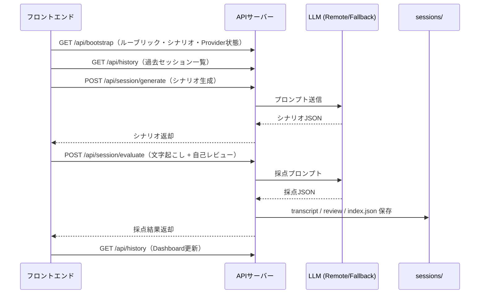

# System Architecture — アプリの仕組みとコード構成

> **コードを触る前に読んでください。** どこを変えると何が変わるかが短時間でわかります。

- 最終更新: 2026-04-19

---

## 全体の構成

ExplainerCore は4つの層で構成されています。

```
┌─────────────────────────────────────────────┐
│  React フロントエンド  (apps/coach-web/src)  │  ← ユーザーが操作する画面
├─────────────────────────────────────────────┤
│  ローカル API サーバー (apps/coach-web/server)│  ← 採点・保存・LLM呼び出し
├─────────────────────────────────────────────┤
│  静的定義ファイル      (data/)               │  ← ルーブリック・シナリオ（JSON）
├─────────────────────────────────────────────┤
│  セッション保存領域    (sessions/)           │  ← 音声・文字起こし・採点結果
└─────────────────────────────────────────────┘
```

この分離により、**訓練ロジック・表示・保存形式・プロンプト設計を独立して改善できます。**

---

## データの流れ



---

## APIエンドポイント一覧

| エンドポイント | 役割 |
|---|---|
| `GET /api/bootstrap` | モジュール・ルーブリック・シナリオ・Provider状態を一括返却 |
| `POST /api/session/generate` | シナリオに対するCoaching情報を生成 |
| `POST /api/session/audio` | 録音ファイルを `sessions/audio/` に保存 |
| `POST /api/session/evaluate` | 文字起こしを採点し、transcript / review を保存 |
| `GET /api/history` | `sessions/reviews/index.json` から履歴を返却 |

**設計上のポイント:**
- ルーブリックとシナリオはメモリにキャッシュし、毎回ファイルを読まない
- 履歴は `sessions/reviews/index.json` を正本として参照する
- Provider設定状態（`CONFIGURED` 表示）と実際のRemote成功は別物

---

## フロントエンドの主要ファイル

| ファイル | 役割 |
|---|---|
| `src/App.tsx` | 画面全体の状態管理とオーケストレーション |
| `src/components/*` | 各UIパネル（モジュール別） |
| `src/hooks/usePracticeRecorder.ts` | 録音・音声認識・音声URL管理 |
| `src/lib/baseline.ts` | Baseline自己診断の計算とlocalStorage draft保存 |
| `src/lib/dashboard.ts` | 履歴集計とダッシュボード表示用の派生計算 |

---

## サーバーの主要ファイル

| ファイル | 役割 |
|---|---|
| `server/index.ts` | APIルーティングのエントリポイント |
| `server/aiProviders.ts` | RemoteプロバイダへのLLM呼び出し（タイムアウト付き） |
| `server/fallbackEngine.ts` | API未設定時のローカル評価エンジン |
| `server/dataStore.ts` | セッション保存・履歴index管理 |

---

## どこを触ると何が変わるか

| やりたいこと | 触る場所 |
|---|---|
| 採点の観点を追加・変更する | `data/rubrics/*.json` |
| 訓練シナリオを追加する | `data/scenarios/*.json` |
| 画面の表示を変える | `src/components/*` |
| AI採点のロジックを変える | `server/fallbackEngine.ts` または `server/aiProviders.ts` |
| 保存形式を変える | `server/dataStore.ts` |
| 録音の挙動を変える | `src/hooks/usePracticeRecorder.ts` |

---

## 今後の拡張候補

- `sessions/reviews/index.json` の再構築コマンド
- transcript / review の JSON スキーマ明文化
- Remote失敗時の詳細ログ分類
- シナリオ追加時の自動検証スクリプト

---

**→ 次に読む:** [provider-setup.md](provider-setup.md)（API キーを設定してRemote採点を有効にする）
